# PremShop — Phase 1 ERD

> **Firmness (owner calibration, 2026-09-01).** This is a contract that hardens incrementally: each model becomes *settled* at the gate of the step that builds it (accounts → S2, catalog incl. the Plan promo fields → S3, orders → S4a, the cart tables in their own `cart` app (`cart/0001`) + DiscountCode/DiscountRedemption + Order's discount columns → S4b, the payment tables + SiteSetting's two payment clocks → S5, notifications → S6, cms → S11). Until then its rows are the best current draft — buildable-from, but revisable at a step gate through a conversation, never silently. Settled from day one regardless of step: status lives on OrderItem with the 7-status list; snapshots at order time; field-level encryption of `DeliveryField.value` and `customer_input` (ADR-0007); REFUNDED gated on an executed Refund row (ADR-0003 + state machine A12 — not ADR-0007, which is encryption and retention); toman storage; append-only `OrderItemEvent`. If building a step shows a drafted table is wrong, the move is stop-and-discuss, not work-around.

All monetary columns are **toman**, `DecimalField(max_digits=12, decimal_places=0)` — `decimal_places=0` enforces integer-valued at the DB level (D3). Rial exists only at the gateway boundary — the two tested conversion points inside the gateway adapter (amount out, verified amount back) — never in storage (ADR-0019). All timestamps are UTC `timestamptz`; Jalali is a render-time concern (core helpers).

Notation below: `Money` = `Decimal(12,0)`, `TS` = `DateTimeField`. "—" in Null column = `NOT NULL`.

---

## 1. Entity-Relationship Diagram

```mermaid
erDiagram
    User ||--o{ Order : places
    Category ||--o{ Product : contains
    Product ||--o{ ProductSpec : describes
    Product ||--o{ Plan : offers
    Product |o--o{ FAQ : "answers (null = site-wide)"
    User |o--o| Cart : "owns (UNIQUE when set)"
    Cart ||--o{ CartItem : holds
    Plan ||--o{ CartItem : "chosen as (PROTECT)"
    Order ||--o{ OrderItem : contains
    Plan ||--o{ OrderItem : "sold as (PROTECT)"
    OrderItem ||--o{ DeliveryField : "delivers (generations)"
    OrderItem ||--o{ OrderItemEvent : "audit trail"
    OrderItem ||--o{ CredentialAccessLog : "reveal log"
    User ||--o{ CredentialAccessLog : revealed_by
    Order ||--o{ Payment : "paid via"
    DiscountCode |o--o{ Order : "discounts (PROTECT, nullable)"
    DiscountCode }o--o{ Product : "scoped to (scope='selected')"
    DiscountCode ||--o{ DiscountRedemption : "spent as"
    User ||--o{ DiscountRedemption : redeems
    Order ||--o| DiscountRedemption : "one per order (UK)"
    User |o--o{ Payment : matched_by
    Payment ||--o{ Refund : "returns money"
    OrderItem |o--o{ Refund : "per-item (nullable)"
    User ||--o{ Refund : created_by
    User |o--o{ Notification : "recipient (null = operator)"
    Order |o--o{ Notification : about
    OrderItem |o--o{ Notification : about
    OrderItem ||--o| Review : "one review (PHASE 2)"

    User {
        bigint id PK
        citext email UK "USERNAME_FIELD"
        varchar full_name
        varchar phone "collected at checkout (D6)"
        bool is_verified
        bigint telegram_id UK "nullable"
        varchar telegram_username
        timestamptz telegram_linked_at
    }
    SiteSetting {
        int id PK "CHECK id = 1 (singleton)"
        bool holiday_stop_new_orders
        text holiday_message
        bool holiday_pause_sla
        time support_start
        time support_end
        jsonb off_weekdays
        varchar support_hours_display
        int gateway_timeout_minutes "inquiry threshold, default 15"
        int unpaid_order_ttl_hours "unpaid-order sweep, default 24"
    }
    Category {
        bigint id PK
        varchar slug UK
        varchar name
    }
    Product {
        bigint id PK
        varchar slug UK
        bigint category_id FK
        varchar delivery_type
        varchar region
        varchar warranty
        smallint delivery_hours
        text delivery_template
        varchar status
        text search_text "normalized (D15)"
    }
    ProductSpec {
        bigint id PK
        bigint product_id FK
        varchar title
        varchar value
        smallint sort_order
    }
    Plan {
        bigint id PK
        bigint product_id FK
        varchar title
        int duration_days "nullable"
        decimal cost_price
        decimal sale_price
        decimal promo_price "nullable; admin-set promotion"
        timestamptz promo_starts_at "nullable = open-ended"
        timestamptz promo_ends_at "nullable = open-ended"
        bool is_available
        bool requires_customer_input
        varchar supplier_url "per-plan upstream listing"
    }
    Cart {
        bigint id PK
        bigint user_id FK "nullable, UNIQUE when set"
        varchar session_key "nullable, indexed"
        timestamptz created_at
        timestamptz updated_at
    }
    CartItem {
        bigint id PK
        bigint cart_id FK "CASCADE"
        bigint plan_id FK "PROTECT"
        smallint quantity "CHECK 1..10"
        timestamptz added_at
    }
    Order {
        bigint id PK
        bigint user_id FK
        int order_number UK "sequential, human-facing"
        varchar tracking_token UK "random URL-safe (D12)"
        decimal subtotal "sum of price_snapshots"
        bigint discount_code_id FK "nullable, PROTECT"
        decimal discount_amount "default 0"
        decimal total_amount "subtotal − discount_amount"
        varchar channel "web|bot|legacy"
        timestamptz created_at
    }
    DiscountCode {
        bigint id PK
        varchar code UK "varchar(8), uppercase, CHECK ^[A-Z0-9]{4,8}$"
        varchar kind "percent|fixed"
        decimal value
        varchar scope "all|selected"
        int max_uses "nullable = unlimited"
        int used_count
        int per_user_limit "nullable"
        decimal min_order_amount "nullable"
        timestamptz valid_from "nullable"
        timestamptz valid_until "nullable"
        bool is_active
        timestamptz created_at
    }
    DiscountRedemption {
        bigint id PK
        bigint discount_code_id FK "PROTECT"
        bigint user_id FK "PROTECT"
        bigint order_id FK "UK, PROTECT"
        decimal amount "what this code actually cost"
        timestamptz created_at
    }
    OrderItem {
        bigint id PK
        bigint order_id FK
        bigint plan_id FK "PROTECT"
        varchar status "7 states (D1)"
        decimal price_snapshot
        decimal cost_snapshot
        decimal actual_cost "nullable"
        jsonb product_snapshot
        text customer_input "ENCRYPTED"
        date expires_at "subscription expiry"
        timestamptz due_at "SLA deadline"
        timestamptz sla_paused_at
        timestamptz paid_at
        timestamptz delivered_at
        varchar cancel_reason "nullable enum"
        timestamptz cancellation_requested_at
        varchar delivery_link_token_hash UK "nullable; magic link (ADR-0008)"
        timestamptz delivery_link_expires_at
        timestamptz delivery_link_used_at
    }
    DeliveryField {
        bigint id PK
        bigint order_item_id FK
        varchar title
        text value "ENCRYPTED"
        smallint sort_order
        bool is_current "generation flag (D10)"
    }
    OrderItemEvent {
        bigint id PK
        bigint order_item_id FK
        varchar from_status "null on creation"
        varchar to_status
        varchar actor "operator|customer|system"
        text note
        timestamptz created_at "append-only"
    }
    CredentialAccessLog {
        bigint id PK
        bigint order_item_id FK
        bigint user_id FK "nullable (magic-link reveal)"
        varchar via "panel|magic_link"
        inet ip
        timestamptz created_at
    }
    Payment {
        bigint id PK
        bigint order_id FK "PROTECT"
        varchar method "gateway|manual"
        varchar status "created|initiated|verified|failed|abandoned"
        decimal amount
        varchar gateway_name
        varchar authority UK "gateway token; nullable"
        varchar ref_id "gateway transaction ref"
        varchar idempotency_key UK
        varchar failure_reason "nullable; 4 choices"
        timestamptz initiated_at
        timestamptz verified_at
        timestamptz failed_at "set for failed AND abandoned"
        bigint matched_by_id FK "nullable; manual fallback operator"
        text note "required non-empty when method=manual"
        timestamptz created_at
    }
    Refund {
        bigint id PK
        bigint payment_id FK "PROTECT"
        bigint order_item_id FK "nullable, PROTECT"
        decimal amount
        varchar destination_card_or_sheba
        varchar bank_ref
        varchar gateway_refund_ref
        bigint created_by_id FK
        timestamptz executed_at "gates CANCELLED→REFUNDED"
    }
    Notification {
        bigint id PK
        varchar dedupe_key UK "occurrence:recipient:channel (D17)"
        bigint user_id FK "null = operator alert"
        varchar channel "email|telegram"
        varchar event_type
        jsonb payload "content-free re credentials (D13)"
        varchar status "pending|sent|failed"
        smallint attempts
        timestamptz next_attempt_at
        bigint order_id FK "nullable"
        bigint order_item_id FK "nullable"
    }
    Page {
        bigint id PK
        varchar slug UK
        varchar title
        text body
    }
    FAQ {
        bigint id PK
        bigint product_id FK "nullable"
        varchar question
        text answer
        smallint sort_order
    }
    Review {
        bigint id PK "PHASE 2"
        bigint order_item_id FK "OneToOne UK"
        smallint rating "CHECK 1..5"
        text body
        varchar status "pending|approved|rejected"
        text admin_reply
    }
```



**Phase 2:** `Review` only (D16). Everything else is phase 1.

---

## 2. Models by App

### `core.SiteSetting` — singleton (D8)

| Field | Type | Null | Default | Note |
|---|---|---|---|---|
| id | int PK | — | 1 | `CHECK (id = 1)`; loaded via `SiteSetting.load()` |
| holiday_stop_new_orders | bool | — | false | checkout hard-stop |
| holiday_message | text | blank | "" | shown to customers when stopped |
| holiday_pause_sla | bool | — | false | drives mass pause/resume (D7) |
| support_start | time | — | 10:00 | structured, for SLA math |
| support_end | time | — | 22:00 | |
| off_weekdays | jsonb | — | `[]` | list of weekday ints (e.g. `[4]` = Friday) |
| support_hours_display | varchar(200) | — | | free-text shown on site; independent of the math fields |
| gateway_timeout_minutes | smallint | — | **15** | how long a payment may sit in `initiated` before the inquiry beat task asks the gateway what happened (ADR-0019). This is the lost-callback net, and nothing else: it never cancels anything — only the gateway's own answer moves a payment out of `initiated` |
| unpaid_order_ttl_hours | smallint | — | **24** | how long an order may sit in `PENDING_PAYMENT` with no verified payment before the daily sweep cancels its items with `cancel_reason='expired_unpaid'`. The sweep **skips any order whose payment is still `initiated`** — never cancel while money may be moving |

> **Two clocks, two names — do not merge them.** `gateway_timeout_minutes` asks the gateway a question; `unpaid_order_ttl_hours` cancels an order. Twenty-four hours is deliberate: the payment-failed message promises the customer their order is still there and hands them a retry link, and a thirty-minute window would make that promise a lie. These two names are the only payment clocks that exist; every other document refers to them by name, and no third name for either is in use anywhere.

### `accounts.User` — custom, `USERNAME_FIELD = email`

| Field | Type | Null | Default | Note |
|---|---|---|---|---|
| email | citext, unique | — | | citext (or `UniqueConstraint(Lower('email'))`) — case-insensitive login |
| password | varchar(128) | — | | unusable password allowed (OTP-only users, D6) |
| full_name | varchar(150) | blank | "" | |
| phone | varchar(15) | blank | "" | collected at checkout day one; SMS channel is a later decision (D6) |
| is_verified | bool | — | false | set by checkout OTP or Telegram link (D6) |
| telegram_id | bigint, unique | yes | null | one telegram ↔ one user |
| telegram_username | varchar(64) | blank | "" | display only |
| telegram_linked_at | TS | yes | null | non-null = accepted verification channel |
| is_active / is_staff / date_joined / last_login | Django standard | | | is_staff = the operator; no RBAC beyond this |

Login OTPs and Telegram link tokens (5-min TTL) live in **Redis, not tables** — see §5.

### `catalog` — **settled at S3** (ADR-0025)

> **Money** everywhere in this document is `DecimalField(max_digits=12, decimal_places=0)`: whole toman, exact arithmetic, the unit visible in the schema. One `MoneyField()` definition in `apps/catalog/models.py` is reused by every money column.

**Category** (flat — no parent, D15)

| Field | Type | Null | Default |
|---|---|---|---|
| name | varchar(100) | — | |
| slug | varchar(100), unique | — | |
| description / intro_html | text | blank | "" |
| seo_title / seo_description | varchar(70)/varchar(160) | blank | "" |
| sort_order | smallint | — | 0 |

**Product**

| Field | Type | Null | Default | Note |
|---|---|---|---|---|
| category | FK Category, **PROTECT** | — | | can't delete a category still holding products |
| name / slug (unique) | varchar(150) | — | | |
| short_description | varchar(300) | blank | "" | |
| full_description | text | blank | "" | rich text |
| image | ImageField | yes | null | |
| delivery_type | varchar(24), choices | — | | `ready_account`·`on_customer_account`·`code_license`·`gift_card` |
| region | varchar(24), choices | — | `global` | `global`·`ir`·`us`·`eu`·`tr` (owner ruling 2026-09-05); must surface in title + checkout confirm (brief §4) |
| warranty | varchar(24), choices | — | `none` | `none`·`days_7`·`full_period` |
| delivery_hours | smallint | — | 24 | promised delivery window; SLA input (D7) |
| delivery_template | text | blank | "" | comma-separated field names; pre-renders delivery form |
| status | varchar(16), choices | — | `draft` | `draft`·`active`·`unavailable` |
| search_text | text | — | "" | normalized (yeh/kaf folding, half-space, digit folding), maintained on save; `icontains` target (D15) |
| seo_title / seo_description | varchar | blank | "" | |
| created_at / updated_at | TS | — | auto | |

**ProductSpec**: `product` FK CASCADE · `title` varchar(100) · `value` varchar(255) · `sort_order` smallint default 0. Admin datalist suggests existing titles (D15).

**Plan**

| Field | Type | Null | Default | Note |
|---|---|---|---|---|
| product | FK Product, CASCADE | — | | cascade halts at OrderItem.plan PROTECT — a product with sold plans is undeletable, which is correct |
| title | varchar(100) | — | | «۱ ماهه» |
| duration_days | int | yes | null | null = no expiry (gift cards); feeds expires_at precompute |
| cost_price | Money | — | | operator-only; copied to cost_snapshot at order time |
| sale_price | Money | — | | the list price; struck through in the UI while a promotion is running |
| promo_price | Money | yes | null | admin-settable promotional price, no code required. Null = no promotion |
| promo_starts_at | TS | yes | null | null = already started |
| promo_ends_at | TS | yes | null | null = no end |
| is_available | bool | — | true | soft delete; never row-delete a sold plan |
| requires_customer_input | bool | — | false | true ⇒ **quantity is capped at 1** per cart line and re-checked at checkout (rule stated under `cart.CartItem`) |
| customer_input_label | varchar(200) | blank | "" | |
| supplier_url | URLField | blank | "" | upstream listing for THIS plan (owner ruling: durations are separate listings upstream); shown on the delivery page's supply column; deliberately NOT copied into product_snapshot — read live via the PROTECTed `OrderItem.plan` FK |
| sort_order | smallint | — | 0 | |

> **One price rule, one function.** `effective_price(plan, at=now)` returns `promo_price` when it is set and `at` falls inside the window (an absent bound means open-ended), otherwise `sale_price`. Every price shown or charged goes through it — catalog cards, product pages, cart lines, the checkout summary, and `OrderItem.price_snapshot` at order time. A promotion is therefore a *pricing* fact, never a discount row: it needs no code, no redemption record and no order column. Duplicating the comparison anywhere else is the bug this note exists to prevent.

### `cart` — persistent, cross-device (ADR-0018, rewritten)

The cart is two tables, not a session dictionary. A signed-out visitor's cart is keyed by `session_key` and the session cookie is configured to outlive the browser window (`SESSION_EXPIRE_AT_BROWSER_CLOSE = False`, `SESSION_COOKIE_AGE = 30 days`), so it is still there tomorrow. A signed-in customer's cart is keyed by `user`, so it follows them to any device.

**These tables live in their own `cart` app, not in `orders`.** `cart` imports `core`, `accounts` and `catalog`; it is imported by `payments` (which resolves a cart into order lines at checkout) and by `panel`. It does **not** import `orders`, and `orders` never imports it — that one-way edge is what keeps `orders` ignorant of how a cart is stored, which is what lets `place_order` take a plain `Sequence[OrderLine]`. Migration home: `cart/0001` lands at **S4b** with the cart tables — never in `orders/0001`.

**Cart**

| Field | Type | Null | Default | Note |
|---|---|---|---|---|
| user | FK User, CASCADE, **unique** | yes | null | one cart per account; the cart dies with the account |
| session_key | varchar(40), indexed | yes | null | Django session key of a signed-out visitor |
| created_at / updated_at | TS / TS | — | auto | `updated_at` drives the guest-cart sweep |

`CHECK ((user_id IS NULL) <> (session_key IS NULL))` — exactly one of the two is set; a cart is either a guest's or an account's, never both and never neither.

**CartItem**

| Field | Type | Null | Default | Note |
|---|---|---|---|---|
| cart | FK Cart, CASCADE | — | | |
| plan | FK Plan, **PROTECT** | — | | a plan sitting in someone's cart cannot be row-deleted; retire with `is_available=false` |
| quantity | smallint | — | 1 | `CHECK BETWEEN 1 AND 10` |
| added_at | TS | — | auto | preserved when a guest cart is claimed |

`UNIQUE (cart, plan)` — adding a plan already in the cart raises its quantity, it never makes a second line.

> **A plan with `requires_customer_input=true` is limited to quantity 1 per line.** Each OrderItem is a separate credential with its own lifecycle, so three units would need three separate inputs, and a form collecting three account passwords under one line is a UI nobody asked for. Enforced in the cart — adding or incrementing to a second unit of such a plan is refused with a clear message, not silently clamped — and **re-validated at checkout**, because a plan's `requires_customer_input` can be flipped on after the line was created. It is a service rule at both points, not a DB `CHECK`: the condition lives on `Plan`, one join away from the row being written. The consequence the services already assume: `customer_inputs` is a mapping of **plan id → a single string**. *Flip condition:* if a customer ever genuinely needs several units of an input-requiring plan, the answer is per-item inputs on the checkout form — never silently reusing one value across items.

**Stored: plan and quantity. Nothing else.** No prices, no names, no snapshots — every amount is recomputed through `effective_price()` from the database on every render and again at checkout. A cart row that is a week old therefore shows today's price, which is the only correct behaviour.

**Merge on login** (the part customers notice, so it gets its own test): if the account already has a cart, the guest cart's lines merge into it — quantities summed per plan and clamped to the per-line maximum of 10 — and the guest cart is deleted. If the account has no cart, the guest cart is **claimed** instead: set `user`, clear `session_key`. Claiming preserves `added_at`; re-creating rows would not.

**Lifecycle:** checkout consumes the cart and clears it **inside** the order-creation transaction, so an order and its emptied cart commit together. A daily beat task deletes guest carts (`user IS NULL`) with `updated_at` older than 30 days; account carts are never swept.

### `orders`

**Order** — no status field; order status is computed from its items (brief §4)

| Field | Type | Null | Default | Note |
|---|---|---|---|---|
| user | FK User, **PROTECT** | — | | financial record; anonymize users, never delete |
| order_number | int, unique | — | sequence | PG sequence starting 1001; human-facing |
| tracking_token | varchar(32), unique | — | `token_urlsafe(16)` | public tracking URL key (D12); no login, no PII exposed |
| subtotal | Money | — | | = sum of item price_snapshots, before discount |
| discount_code | FK DiscountCode, **PROTECT** | yes | null | a code that has been spent can never be deleted (ADR-0020) |
| discount_amount | Money | — | 0 | computed server-side at checkout from the DB row, never from the browser |
| total_amount | Money | — | | what the customer pays and what the gateway must report back |
| channel | varchar(8), choices | — | `web` | `web`·`bot`·`legacy` (launch backfill, D12) |
| created_at | TS | — | auto | |

> **Money invariant (stated, constrained, tested).** `subtotal = Σ item.price_snapshot` · `total_amount = subtotal − discount_amount` · `total_amount >= 0`. Each `price_snapshot` is `effective_price(plan)` at order time, so a promotion is already inside `subtotal`. A discount is capped at the *eligible* subtotal when computed, so the total can never go negative (ADR-0020, amending ADR-0005). The gateway verify compares its reported amount against `total_amount` and rejects a mismatch (ADR-0019).

**DiscountCode** (ADR-0020) — the mechanism whose absence was the reason ADR-0005 cut `Order.discount`; it exists now

| Field | Type | Null | Default | Note |
|---|---|---|---|---|
| code | varchar(8), unique | — | | **stored uppercase**, `CHECK (code ~ '^[A-Z0-9]{4,8}$')` — Latin letters and digits only, four to eight characters. Input typed in lowercase is normalised before lookup, so `norooz` finds `NOROOZ`; storing one canonical form beats a case-insensitive column because it also stops two visually identical codes existing |
| kind | varchar(8), choices | — | | `percent`·`fixed` |
| value | Money | — | | percent points when `kind='percent'`, toman when `fixed`; always > 0 |
| scope | varchar(8), choices | — | `all` | `all`·`selected`. `selected` discounts only the lines whose plan belongs to a listed product |
| products | M2M Product | — | ∅ | the scope list; read only when `scope='selected'`, empty otherwise. Operator picks them in the admin panel |
| max_uses | int | yes | null | null = unlimited |
| used_count | int | — | 0 | incremented under `select_for_update()` **inside the order-creation transaction** — a single-use code cannot be spent twice concurrently |
| per_user_limit | int | yes | null | null = no per-user cap; counted from `DiscountRedemption`, which is why that table exists |
| min_order_amount | Money | yes | null | **compared against `Order.subtotal` — the whole order's total before discount, never `eligible_subtotal`.** Stated here once; every other document matches this. A code with `scope='selected'` therefore has a threshold about basket size and a discount about scoped lines, which is the intended reading of "spend X to get Y off" |
| valid_from / valid_until | TS / TS | yes | null | either or both may be open-ended |
| is_active | bool | — | true | operator kill switch, independent of dates and counts |
| created_at | TS | — | auto | |

Validation and application are **server-side at checkout only**; the browser sends a code string and nothing else. One code per order — codes never stack with each other.

> **The computation, stated once and tested.** `eligible_subtotal` = the sum of the line totals in scope (`scope='all'` ⇒ every line; `scope='selected'` ⇒ only lines whose plan's product is in `products`) — the *eligible* subtotal, never the order subtotal. A percent discount is `round(eligible_subtotal * value / 100)` to whole toman, `ROUND_HALF_UP`. A fixed discount is `min(value, eligible_subtotal)`. The result is clamped so `total_amount` can never fall below zero. Every input is read from the database; nothing the browser sent is ever an input.
>
> **Stacking with promotions, decided.** A code applies **on top of** promotional pricing: line totals are built from `effective_price()`, so the code discounts what the customer would actually pay. Excluding promoted items is the named future option — it flips only if margin on a promotion is actually being lost, and it arrives as a `DiscountCode` field then, not as a flag nobody asked for now.

**DiscountRedemption** — one row per code actually spent

| Field | Type | Null | Note |
|---|---|---|---|
| discount_code | FK DiscountCode, **PROTECT** | — | |
| user | FK User, **PROTECT** | — | the count that `per_user_limit` is enforced against |
| order | FK Order, **PROTECT**, **unique** | — | one redemption per order, DB-enforced — the same guarantee as "one code per order" |
| amount | Money | — | what this code actually cost, in toman; the audit trail of a campaign's real price |
| created_at | TS | — | auto |

Written **inside** the order-creation transaction alongside the `used_count` increment, under the same `select_for_update()` on the DiscountCode row. `per_user_limit` cannot be enforced without it: counting orders was the previous plan and it is wrong the moment an order is cancelled or a code is changed. `amount` duplicates `Order.discount_amount` on purpose — the order column is what the customer paid, this one is what the campaign spent, and reporting reads the second.

**OrderItem** — carries the 7-state machine (D1)

| Field | Type | Null | Default | Note |
|---|---|---|---|---|
| order | FK Order, CASCADE | — | | composition; deletion of paid orders is blocked by Payment PROTECT anyway |
| plan | FK Plan, **PROTECT** | — | | plan row must outlive every sale (snapshot has the display data; FK keeps the supply/re-buy link) |
| status | varchar(24), choices | — | `PENDING_PAYMENT` | `PENDING_PAYMENT`·`QUEUED`·`AWAITING_INPUT`·`DELIVERED`·`REPLACEMENT_REQUESTED`·`CANCELLED`·`REFUNDED` |
| price_snapshot | Money | — | | |
| cost_snapshot | Money | — | | copied from Plan.cost_price at order time (D10) |
| actual_cost | Money | yes | null | delivery-form editable, prefilled from cost_snapshot; replacements add to it (D10) |
| product_snapshot | jsonb | — | | name, plan title, region, warranty, specs at purchase time |
| customer_input | **EncryptedTextField** | blank | "" | may contain the customer's own password (D10) |
| delivery_note | text | blank | "" | operator → customer, plaintext non-secret |
| expires_at | date | yes | null | subscription expiry; precomputed from duration_days, editable |
| due_at | TS | yes | null | set at payment confirm via the pure SLA function (D7) |
| sla_paused_at | TS | yes | null | set on QUEUED→AWAITING_INPUT; resume: `due_at += now − sla_paused_at` |
| paid_at | TS | yes | null | denormalized from Payment.verified_at; keeps queue/metrics queries join-free |
| delivered_at | TS | yes | null | |
| cancel_reason | varchar(32), choices | yes | null | `expired_unpaid`·`customer_before_payment`·`customer_after_payment`·`supply_failure`·`input_timeout`·`warranty_refund`·`operator` |
| cancellation_requested_at | TS | yes | null | request is not a status (D1); powers queue badge |
| delivery_link_token_hash | char(64), unique | yes | null | SHA-256 of the single-use delivery-link token (ADR-0008); the raw token exists only in the sent message. Issued at A5, regenerated at A10a (old link dead), invalidated at A11 |
| delivery_link_expires_at | TS | yes | null | issue + 72h |
| delivery_link_used_at | TS | yes | null | stamped under the item lock on first open — single-use |
| created_at | TS | — | auto | |

**DeliveryField** — `order_item` FK CASCADE · `title` varchar(100) · `value` **EncryptedTextField** · `sort_order` smallint · `is_current` bool default true · `created_at` TS. Replacement writes a new generation and flips old rows to `is_current=false`; old rows are kept (D10).

**OrderItemEvent** (append-only, D9) — `order_item` FK CASCADE · `from_status` varchar(24) null (null = creation) · `to_status` varchar(24) · `actor` varchar(12) choices `operator`·`customer`·`system` · `note` text blank · `created_at` TS. Written **inside** every transition transaction; the occurrence it records seeds Notification.dedupe_key (D17/D18). No update/delete paths in code.

**CredentialAccessLog** (D9) — `order_item` FK CASCADE · `user` FK User **PROTECT**, **nullable** (a magic-link reveal has no authenticated user — attribution is the redeemed token itself, ADR-0008) · `via` varchar(12) choices `panel`·`magic_link` · `ip` inet · `created_at` TS. One row per reveal, operator included. CASCADE on order_item is safe: items holding credentials are transitively undeletable via Payment PROTECT.

### `payments`

**Payment** — own small machine (ADR-0019), separate from the item machine

| Field | Type | Null | Default | Note |
|---|---|---|---|---|
| order | FK Order, **PROTECT** | — | | deleting an order with money history must fail loudly |
| method | varchar(16), choices | — | `gateway` | `gateway`·`manual`. `manual` = the operator-only "payment received outside the gateway" action (ADR-0019, the manual fallback): same confirmed Payment, same item transitions, listed separately in reconciliation, never customer-facing |
| status | varchar(12), choices | — | `created` | `created`·`initiated`·`verified`·`failed`·`abandoned`. `initiated` = gateway token obtained and customer redirected; `verified` only ever set by a **server-to-server verify** (or the manual action); `abandoned` only by the inquiry beat task after the gateway says the payment was never completed |
| amount | Money | — | | order `total_amount` at payment creation; verify rejects any gateway-reported amount that differs |
| gateway_name | varchar(64) | blank | "" | which provider handled it (empty for `manual`) |
| authority | varchar(128), **unique** | yes | null | the gateway's payment token/authority from the request call — the key the callback and the inquiry task both look up. **UNIQUE, nullable**: a retry that obtains a fresh token overwrites it on the same row, so uniqueness costs nothing, while an impossible token collision becomes a loud failure instead of a silent mismatch. Null (not `""`) when there is no token yet or the payment is `manual` — PG ignores NULLs in a unique index, empty strings it would not |
| ref_id | varchar(64) | blank | "" | gateway transaction reference returned by verify; the customer-visible receipt number |
| idempotency_key | varchar(64), unique | — | | the key sent to the **gateway on the initiate call**, so a retried or double-submitted initiate cannot create two payment requests upstream. UNIQUE because that is what makes the key a key. It plays **no part in confirmation** — see the note below |
| failure_reason | varchar(24), choices | yes | null | `gateway_failed`·`cancelled_by_customer`·`amount_mismatch`·`abandoned`. Set whenever the payment leaves the live states unpaid; it is what the customer-facing failure message and the operator's reconciliation view both read |
| initiated_at | TS | yes | null | stamped on `created → initiated`; the inquiry task's scan key |
| verified_at | TS | yes | null | stamped on `→ verified`; source of `OrderItem.paid_at` and the SLA clock start |
| failed_at | TS | yes | null | stamped for **both** `failed` and `abandoned` — one column, because the two differ in *why* (`failure_reason`), not in *when* |
| matched_by | FK User, **PROTECT** | yes | null | the operator who recorded a `manual` payment; null for gateway payments |
| note | text | blank | "" | **required non-empty for `method='manual'`** (service-enforced): the free-text reference for a payment that has no gateway record |
| created_at | TS | — | auto | |

Nothing here is trusted from the browser. Redirect parameters are attacker-controllable and are used only to *look up* the payment; the verify call decides.

> **What makes confirmation idempotent — two mechanisms, two jobs.** `payments.confirm_payment` takes a row lock on the Payment (`select_for_update()`), **re-reads `status` under that lock**, and returns the payment unchanged if it is already `verified`. That lock-and-re-read — never an unlocked `if not payment.verified` — is the guarantee that a repeated callback, a customer refresh, or a callback racing the inquiry task confirms exactly once: one verified payment, one set of item transitions, one `payment.verified` event. `idempotency_key` is the *upstream* guard on initiate and does nothing here. Neither is the partial unique index (§3).

**Not columns, deliberately:** no `paid_amount` — the gateway's reported amount is compared against `Order.total_amount` and discarded, because a mismatch fails the payment (`failure_reason='amount_mismatch'`), so there is never a differing amount worth storing. No `unique_amount`, no `receipt_image`, no `expires_at`, no `submitted_at`, no stored raw gateway payload. A failed payment leaves the order `PENDING_PAYMENT` and payable — the retry link in the failure message depends on it — so **nothing in this table cancels items**. The only thing that cancels an unpaid order is the daily sweep on `SiteSetting.unpaid_order_ttl_hours`, and it skips any order whose payment is still `initiated`.

**Refund** (D2) — one row per outbound transfer; refunds are never payment statuses

| Field | Type | Null | Note |
|---|---|---|---|
| payment | FK Payment, **PROTECT** | — | money audit chain |
| order_item | FK OrderItem, **PROTECT** | yes | null = order-level/partial money return not tied to one item |
| amount | Money | — | > 0 |
| destination_card_or_sheba | varchar(34) | blank | manual-transfer route only — collected before execution; the 21-day input-timeout auto-cancel (ADR-0009) creates the row blank. Execution requires either this + bank_ref, or gateway_refund_ref (service-enforced) |
| bank_ref | varchar(64) | blank | filled at execution of a manual bank transfer |
| gateway_refund_ref | varchar(64) | blank | the provider's refund reference when the refund went back through the gateway's refund API (ADR-0019, preferred route where supported) |
| note | text | blank | |
| created_by | FK User, **PROTECT** | — | |
| created_at / executed_at | TS / TS null | | non-null executed_at is the service-enforced gate for CANCELLED→REFUNDED, whichever route was used |

The reference shown to a customer is **route-agnostic**: `gateway_refund_ref` when the money went back through the gateway, `bank_ref` when it went by manual transfer — one field in the message and the panel, resolved server-side. Notification payloads carry it as `refund_ref` for exactly this reason; no customer-facing surface names `bank_ref` directly.

**No card digits in any refund message.** A gateway refund returns to the original card automatically and we never learn its digits, so there is no `destination_last4` to render — the placeholder does not exist. On the manual route `destination_card_or_sheba` is an operator field for executing the transfer, not something to echo back at the customer. Refund messages carry `refund_ref` and nothing else about the destination.

### `notifications`

**Notification** (outbox, D17)

| Field | Type | Null | Default | Note |
|---|---|---|---|---|
| dedupe_key | varchar(128), unique | — | | `{occurrence}:{recipient}:{channel}`, recipient = the user id or the literal `op`. **The canonical registry of key families is state-machine §3** — this column just stores what that registry produces. The families it holds: `evt:` (item transitions) · `pay:` · `refund:` · `renew7:` / `renew0:` (expiring-soon / expired) · `delay:` · `remind:` · `hpause:` / `hresume:` · `signin:` · `cancelreq:` · `overdue:`. Shapes, e.g.: `evt:{order_item_event_id}:{recipient}:{channel}` · `pay:{payment_id}:{to_status}:{recipient}:{channel}` · `renew7:{order_item_id}:{expires_at_iso}:{recipient}:{channel}` · `overdue:{date_iso}T{hour}:op:{channel}`; concretely `pay:1041:verified:op:telegram`, `renew7:5512:2026-10-01:8:email`. Unique per occurrence, so post-replacement re-delivery notices are legal; renewal keys include `expires_at`, so extending it re-arms the reminder |
| user | FK User, CASCADE | yes | null | **null = operator alert** (goes to operator chat_id/email from settings) |
| channel | varchar(12), choices | — | | `email`·`telegram` |
| event_type | varchar(48) | — | | `payment.verified`, `payment.failed`, `item.delivered`, `item.awaiting_input`, `item.supply_delayed`, `item.replaced`, `item.replacement_rejected`, `item.refunded`, `items.overdue_digest`, `subscription.expiring_soon` (key `renew7:`), `subscription.expired` (key `renew0:`), … (canonical registry lives in state-machine §3). There is no `order.created`: the operator's new-order alert fires on `payment.verified` |
| payload | jsonb | — | `{}` | content-free re credentials: order number + panel link only (D13) |
| order / order_item | FK, SET_NULL | yes | null | both nullable (D17); history survives cleanup |
| status | varchar(12), choices | — | `pending` | `pending`·`sent`·`failed` (failed = retries exhausted, terminal) |
| attempts | smallint | — | 0 | |
| next_attempt_at | TS | yes | null | exponential backoff |
| last_error | text | blank | "" | |
| created_at / sent_at | TS / TS null | | |

Rows are enqueued by `events.emit()` via `transaction.on_commit` (D18). Beat also pings the external dead-man heartbeat (D17) — no table needed.

### `cms`

**Page** — `slug` varchar(100) unique · `title` varchar(200) · `body` text (rich) · `seo_title` varchar(70) blank · `seo_description` varchar(160) blank · `created_at`/`updated_at`. Terms, refund policy, privacy, about/contact — Enamad prerequisites, panel-editable.

**FAQ** — `product` FK Product CASCADE **null** (null = site-wide FAQ page; set = product-page block) · `question` varchar(300) · `answer` text · `sort_order` smallint · `is_published` bool default true.

### `reviews` (PHASE 2, D16)

**Review** — `order_item` OneToOne CASCADE (unique ⇒ one review per delivered item) · `rating` smallint · `body` text · `status` varchar(12) `pending`·`approved`·`rejected` default pending · `admin_reply` text blank · `created_at` · `moderated_at` TS null. Verified-buyer enforced in the service (item must be DELIVERED and owned by the requester). No helpful_count, no voting, no automated scanning — moderation UI carries the leaked-credential reminder line instead.

---

## 3. Constraints

### Unique

| Model | Constraint |
|---|---|
| User | `email`; `telegram_id` (nullable — PG ignores NULLs) |
| Category / Product / Page | `slug` |
| Order | `order_number`; `tracking_token` |
| DiscountCode | `code` — stored uppercase, so case can never fork one code into two |
| DiscountRedemption | `order_id` — one redemption per order |
| Payment | `idempotency_key`; `authority` (nullable — PG ignores NULLs) |
| Notification | `dedupe_key` |
| Review | `order_item_id` (OneToOne) |
| OrderItem | `delivery_link_token_hash` (nullable — PG ignores NULLs) |
| Cart | `user_id` (nullable — one cart per account, unlimited guest carts) |
| CartItem | `(cart_id, plan_id)` — one line per plan |
| SiteSetting | singleton via check below |

### Partial unique (exact predicates)

```sql
-- one live payment attempt per order
CREATE UNIQUE INDEX payment_uniq_active_order
  ON payments_payment (order_id)
  WHERE status IN ('created', 'initiated');
```

(Django `UniqueConstraint(fields=['order'], condition=Q(status__in=['created','initiated']))`.) A failed or abandoned attempt leaves the index, so the customer can retry from the payment-failed link; a `verified` one leaves it too. This index only stops two *live* attempts on one order — the locked re-read inside `confirm_payment` (§2) is what makes confirmation idempotent, and `idempotency_key` is what makes the initiate call idempotent at the gateway.

### Check constraints

| Model | Constraint |
|---|---|
| SiteSetting | `CHECK (id = 1)`; `gateway_timeout_minutes > 0`; `unpaid_order_ttl_hours > 0` |
| Product | `delivery_hours BETWEEN 1 AND 48`; `status IN ('draft','active','unavailable')` |
| Plan | `cost_price >= 0 AND sale_price >= 0`; `duration_days IS NULL OR duration_days > 0`; `promo_price IS NULL OR (promo_price > 0 AND promo_price < sale_price)` — a "promotion" that is not cheaper is a data-entry error, not a promotion; `promo_starts_at IS NULL OR promo_ends_at IS NULL OR promo_starts_at < promo_ends_at` |
| Cart | `(user_id IS NULL) <> (session_key IS NULL)` — exactly one owner |
| CartItem | `quantity BETWEEN 1 AND 10`; **service-enforced, not a CHECK:** `quantity = 1` when the plan has `requires_customer_input=true` (the condition lives on `Plan`, one join away — refused in the cart, re-validated at checkout) |
| Order | `subtotal >= 0`; `discount_amount >= 0`; `total_amount >= 0`; `total_amount = subtotal - discount_amount` — the money invariant enforced by the DB, not only by the service; `channel IN ('web','bot','legacy')` |
| DiscountCode | `code ~ '^[A-Z0-9]{4,8}$'`; `kind IN ('percent','fixed')`; `scope IN ('all','selected')`; `value > 0`; `used_count >= 0`; `max_uses IS NULL OR max_uses > 0`; `per_user_limit IS NULL OR per_user_limit > 0`; `min_order_amount IS NULL OR min_order_amount >= 0`; `valid_from IS NULL OR valid_until IS NULL OR valid_from < valid_until` |
| DiscountRedemption | `amount >= 0` |
| OrderItem | `status IN (…7 values…)`; `price_snapshot >= 0 AND cost_snapshot >= 0`; `actual_cost IS NULL OR actual_cost >= 0`; `cancel_reason IS NULL OR cancel_reason IN (…7 values…)`; `status NOT IN ('CANCELLED','REFUNDED') OR cancel_reason IS NOT NULL` — a cancellation can never lose its reason |
| Payment | `status IN ('created','initiated','verified','failed','abandoned')`; `method IN ('gateway','manual')`; `amount >= 0`; `status <> 'verified' OR verified_at IS NOT NULL`; `failure_reason IS NULL OR failure_reason IN ('gateway_failed','cancelled_by_customer','amount_mismatch','abandoned')`; `status NOT IN ('failed','abandoned') OR (failure_reason IS NOT NULL AND failed_at IS NOT NULL)` — an unpaid ending always records why and when; `method <> 'manual' OR matched_by_id IS NOT NULL` — a manual payment always names the operator who recorded it |
| Refund | `amount > 0` |
| Notification | `attempts >= 0`; `channel IN ('email','telegram')`; `status IN ('pending','sent','failed')` |
| Review (ph2) | `rating BETWEEN 1 AND 5`; `status IN ('pending','approved','rejected')` |

Transition legality (the matrix itself) is service-enforced with `select_for_update()` — a check constraint can see the target state but not the edge.

### FK `on_delete` summary

| FK | on_delete | Rationale |
|---|---|---|
| Order.user, Order.discount_code, Payment.order, Refund.payment, Refund.order_item, Refund.created_by, Payment.matched_by, CredentialAccessLog.user, DiscountRedemption.discount_code / .user / .order | **PROTECT** | anything in the money/audit chain must fail loudly on delete; users/orders are anonymized, never deleted. A spent DiscountCode is part of how an order's total was computed — retire it with `is_active=false`, never row-delete |
| OrderItem.plan, **CartItem.plan** | **PROTECT** | a sold plan row must exist forever; retire with `is_available=false`. Snapshot covers display, the FK keeps the profit/re-buy/renewal link live. A plan sitting in a live cart is protected for the same reason a sold one is: deleting it would silently empty someone's cart |
| Product.category | **PROTECT** | no orphan products; empty the category first |
| OrderItem.order; DeliveryField / OrderItemEvent / CredentialAccessLog .order_item; ProductSpec / Plan / FAQ .product; Review.order_item; Notification.user; **Cart.user**; **CartItem.cart** | CASCADE | pure children. Every credential-bearing chain is transitively PROTECTed through Payment, so CASCADE here can only ever fire on unpaid/draft data. A cart holds no money history: it dies with its account, and its lines die with it |
| DiscountCode.products (M2M) | — | plain join table; unlinking a product narrows the scope of a live code and touches no order, because scope is read at checkout and the outcome is frozen in `discount_amount` |
| Notification.order, Notification.order_item | SET_NULL | history rows must survive their subject (D17) |

---

## 4. Indexes beyond PKs/uniques

Django auto-indexes every FK; those cover the per-item timeline (`OrderItemEvent.order_item`), reveal log, delivery fields, "my orders" (`Order.user`), and item lists without further work.

| Index | Named query it serves |
|---|---|
| `OrderItem (status, due_at)` | Operator queue tabs: `WHERE status = 'QUEUED' ORDER BY due_at ASC` (default tab, D-brief §8); same index serves the AWAITING_INPUT tab, the stats bar counts, and the overdue-order alarm scan (`status='QUEUED' AND due_at < now()`) |
| Partial `OrderItem (expires_at) WHERE status = 'DELIVERED' AND expires_at IS NOT NULL` | Daily renewal-reminder beat: items expiring in 7 days / today — scans only live subscriptions, skips the whole non-delivered and non-expiring population |
| Partial `Payment (initiated_at) WHERE status = 'initiated'` | The **lost-callback inquiry** beat task (ADR-0019, mandatory): `WHERE status='initiated' AND initiated_at < now() − gateway_timeout_minutes` → ask the gateway, verify the ones it reports paid, abandon the rest. Index holds only the handful of in-flight payments |
| Partial `OrderItem (created_at) WHERE status = 'PENDING_PAYMENT'` | The **unpaid-order sweep**: `WHERE status='PENDING_PAYMENT' AND created_at < now() − unpaid_order_ttl_hours`, minus the orders whose payment is still `initiated`. Holds only orders nobody has paid for yet |
| Partial `Notification (next_attempt_at) WHERE status = 'pending'` | Outbox worker poll: `WHERE status='pending' AND next_attempt_at <= now() ORDER BY next_attempt_at` |
| `Cart (session_key)` | Every page load by a signed-out visitor resolves the cart from the session key — the single hottest cart lookup there is. `Cart.user` needs no separate index: its unique constraint is one |
| Partial `Cart (updated_at) WHERE user_id IS NULL` | Daily guest-cart sweep: `WHERE user_id IS NULL AND updated_at < now() − 30 days`. Account carts are never scanned |
| `DiscountRedemption (discount_code, user)` | The `per_user_limit` check at checkout: `COUNT(*) WHERE discount_code_id = ? AND user_id = ?`. Composite in that order, because the code is always the more selective leading column |

`Payment.authority` needs no separate index — it is unique (§3), and that unique index is the lookup the callback and the inquiry task both use, arriving as they do holding the gateway's token rather than our id.

**Deliberately unindexed:** `Product.search_text` (icontains can't use btree; catalog is a few dozen rows — seq scan is free; pg_trgm is the upgrade path if the catalog ever grows 100×), `DiscountCode.code` beyond its unique index (a handful of rows), `Plan.promo_ends_at` (`effective_price` is evaluated on plans already fetched for a page, never scanned across the table), and operator panel search fields (`ref_id`, customer name — at <1 order/day every table involved is thousands of rows at most; add on measured slowness, not speculation).

---

## 5. Deliberately NOT modeled

| Absent | Why |
|---|---|
| ~~Cart table~~ — **reversed 2026-09-01** | The cart is now **two tables**, `Cart` and `CartItem` (§2). The session-only version ADR-0018 originally chose was too weak on the one axis customers actually feel: a session cart cannot follow a signed-in customer to another device, and that is table stakes on the platforms this shop is judged against. What the session version got right is kept — the cart still stores only plan and quantity, and every amount is still recomputed from the database. The costs it avoided are now paid deliberately: one daily sweep of guest carts older than 30 days, and `CartItem.plan` PROTECTed so a deleted plan can never silently empty a cart |
| Promo/discount stacking flag | A code applies on top of promotional pricing, decided once (§2). Excluding promoted items is the named future option; it flips on evidence that a promotion's margin is actually being lost, and it becomes a `DiscountCode` field then |
| Card-to-card apparatus (`unique_amount` and its partial unique index, `paid_amount`, receipt upload, destination-card slots, `UnmatchedTransfer`) | ADR-0019 replaced the rail with a gateway; ADR-0006 is superseded, not deleted. Amount-matching, receipt storage and unmatched-transfer reconciliation all existed to answer "did this money arrive?" — a server-to-server verify answers it directly |
| Supplier / FX rate | one upstream marketplace, manual pricing; `cost_snapshot`/`actual_cost` capture what matters (profit) without modeling why |
| Inventory / stock | nothing delivers instantly; `Product.status='unavailable'` is the whole stock model |
| RBAC / roles | one operator = `is_staff`; a second role would be the trigger to add it |
| Identity tables (EmailIdentity/TelegramIdentity) | brief §19-الف resolved to flat fields on User; splitting is a mechanical migration if a third login method ever appears |
| Wallet / ledger | brief out-of-scope; if it comes, it arrives double-entry from day one |
| Ticket system | email + Telegram suffice |
| OTP codes / Telegram link tokens | 5-minute TTL values — Redis with expiry, not rows needing a cleanup job |
| Queue soft-lock (`locked_by`/`locked_at`) | brief cut the logic for one operator; adding the two columns later is a trivial additive migration |

---

## Concerns

1. **Payment-model settling depends on the provider.** `authority` / `ref_id` / `gateway_name` are named for the Zibal-class shape; the exact field lengths and whether a provider returns one reference or two is confirmed at S5 against real API docs. The *machine* (created → initiated → verified|failed|abandoned, verify-only confirmation, amount check, idempotency) is settled now and is not a provider detail. Note the build-order dependency from ADR-0019: the gateway needs Enamad, Enamad needs a live orderable site, so S4b (cart + checkout) and S11 (legal pages) land before S5 — during the wait the operator sells via the `manual` fallback.
2. **Operator-alert recipient.** D17 specifies the outbox's order/order_item FKs but not the recipient column. Modeled as nullable `Notification.user` with NULL meaning "operator channels from settings". Flagging the interpretation so it doesn't pass silently.
3. **Refund.order_item NULL vs the REFUNDED gate.** A NULL-item Refund (order-level partial money return, D2) can never satisfy D1's "no item enters REFUNDED without an executed Refund row" for any specific item. Consistent as long as the service requires an item-linked Refund whenever the intent is moving that item to REFUNDED; NULL-item refunds are for money-only returns (an order-level goodwill return). Pinning that reading here.
4. **`Order.total_amount` is now derived, and the DB says so.** The check constraint `total_amount = subtotal - discount_amount` makes a bad write fail rather than silently underbill. It also means the discount can never be recomputed after the fact: `discount_amount` is a snapshot, exactly like `price_snapshot` — editing the DiscountCode row later must not move a placed order's total.
