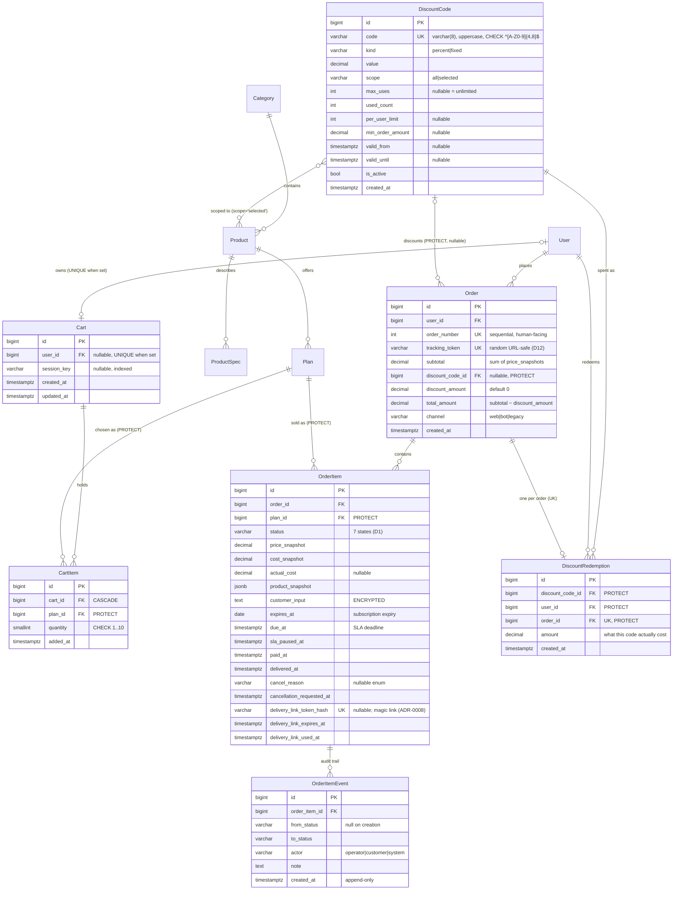

# PremShop — Phase 1 ERD

> **At a glance.** The phase-1 tables and the database rules that protect them.
> **Built:** `accounts.User` (S2, `apps/accounts/models.py`, ADR-0024) and `catalog` (S3, `apps/catalog/models.py`, ADR-0025). For a built table, `models.py` and its migrations are the source of truth; this file keeps only what the code cannot say.
> **Contract, settled at the step that builds it:** `orders` (S4a), `cart` (S4b), the discount tables (S4a or S4b — the documents disagree; listed for the owner in `docs-local/progress.md`).
> **Intent only, re-specified when their step is planned:** `payments` (S6b, completed at S5), `core.SiteSetting` (its columns arrive with the steps that use them: payment clocks S5, support hours S7, holiday switches S10), `notifications` (S6), `DeliveryField` and `CredentialAccessLog` (S7), `cms` (S11). The full earlier draft of all of it is `git show 027c5d1:docs/data-model.md`.
> **Read for S4a:** §2 `orders`, §3 Constraints, §4 Indexes.

> **Firmness (owner calibration, 2026-09-01).** This is a contract that hardens incrementally: each model becomes *settled* at the gate of the step that builds it (accounts → S2, catalog incl. the Plan promo fields → S3, orders → S4a, the cart tables in their own `cart` app (`cart/0001`) + DiscountCode/DiscountRedemption + Order's discount columns → S4b, the payment tables + SiteSetting's two payment clocks → S5, notifications → S6, cms → S11). Until then its rows are the best current draft — buildable-from, but revisable at a step gate through a conversation, never silently. Settled from day one regardless of step: status lives on OrderItem with the 7-status list; snapshots at order time; field-level encryption of `DeliveryField.value` and `customer_input` (ADR-0007); REFUNDED gated on an executed Refund row (ADR-0003 + state machine A12 — not ADR-0007, which is encryption and retention); toman storage; append-only `OrderItemEvent`. If building a step shows a drafted table is wrong, the move is stop-and-discuss, not work-around.

All monetary columns are **toman**, `DecimalField(max_digits=12, decimal_places=0)` — `decimal_places=0` enforces integer-valued at the DB level (D3). Rial exists only at the gateway boundary — the two tested conversion points inside the gateway adapter (amount out, verified amount back) — never in storage (ADR-0019). All timestamps are UTC `timestamptz`; Jalali is a render-time concern (core helpers).

Notation below: `Money` = `Decimal(12,0)`, `TS` = `DateTimeField`. "—" in Null column = `NOT NULL`.

---

## 1. Entity-Relationship Diagram

Who points at whom, for the built tables and the S4a/S4b tables. The S4a/S4b entities keep their drafted columns, as they stood before 2026-09-21 (§2 carries the same columns with their rules — de-duplicating the two is part of S4a's briefing); the built tables' columns live in `models.py`.

**Not drawn (beyond S4b):** `SiteSetting`, `Payment`, `Refund`, `Notification`, `DeliveryField`, `CredentialAccessLog`, `Page`, `FAQ`, and the phase-2 `Review`. Full earlier draft: `git show 027c5d1:docs/data-model.md` (§1). It is re-specified when each table's step (S5, S6, S6b, S7, S10, S11) is planned.

---

## 2. Models by App

### `core.SiteSetting` — singleton (D8)

One row, `CHECK (id = 1)`, holding the operator's clocks and switches. Its columns arrive with the steps that use them: the two payment clocks at S5, the support-hours schedule behind the SLA deadline at S7 (ADR-0009), the holiday switches at S10. One rule is already fixed by ADR-0019: the two payment clocks are two separately named columns and are never merged. `gateway_timeout_minutes` (default 15) decides when the inquiry task asks the gateway about a payment stuck in `initiated`, and it never cancels anything; `unpaid_order_ttl_hours` (default 24) decides when the daily sweep cancels an unpaid order with `cancel_reason='expired_unpaid'`, and the sweep skips any order whose payment is still `initiated`.

Full earlier draft: `git show 027c5d1:docs/data-model.md` (§2 `core.SiteSetting`). It is re-specified when S5 is planned.

### `accounts.User` — custom, `USERNAME_FIELD = email` — **built at S2** (ADR-0024)

Source of truth: `apps/accounts/models.py` and migration `accounts/0001`. What the code cannot say:

- **It is frozen as the project's migration 0001.** Django lets `AUTH_USER_MODEL` be swapped only while the database has no tables; once anything holds a foreign key to it, reshaping it means rebuilding the schema by hand on a live system with real orders in it. New identity fields arrive as additive migrations; the model itself is never replaced.
- **An account created by a login code holds an unusable password** (D6). The account exists and no password opens it until the customer sets one.
- **Email is unique case-insensitively, and the database enforces it** (`UniqueConstraint(Lower("email"))` beside `unique=True`), not only the manager's lowercasing: the admin, a shell and a data import all reach the table without the manager.
- **`is_staff` is the operator.** There is no RBAC beyond it (§5).

Login codes live in **Redis, not tables**, for 10 minutes (`CODE_TTL_SECONDS` in `apps/accounts/otp.py`, owner ruling 2026-09-04). Telegram link tokens (S8) are planned at 5 minutes. See §5.

### `catalog` — **built at S3** (ADR-0025)

Source of truth: `apps/catalog/models.py`, `apps/catalog/pricing.py` and the `catalog` migrations; the CHECK constraints are listed in §3. What the code cannot say, or says in one place that every later step must honour:

> **Money** everywhere in this document is `DecimalField(max_digits=12, decimal_places=0)`: whole toman, exact arithmetic, the unit visible in the schema. One `MoneyField()` definition in `apps/catalog/models.py` is reused by every money column.

> **One price rule, one function.** Every price shown or charged goes through `catalog.pricing.effective_price` — catalog cards, product pages, cart lines, the checkout summary, and `OrderItem.price_snapshot` at order time. A promotion is therefore a *pricing* fact, never a discount row: it needs no code, no redemption record and no order column (ADR-0021). Duplicating the comparison anywhere else is the bug this note exists to prevent.

- **A product with sales is undeletable, on purpose.** `Plan.product` cascades, but the cascade halts at `OrderItem.plan` PROTECT (§3). A sold plan is retired with `is_available=false`, never row-deleted.
- **`Product.region` must surface in the title area and on the checkout confirmation** (brief §4). The product page does the first; S4b's checkout does the second.
- **`Plan.supplier_url` is deliberately not copied into `OrderItem.product_snapshot`.** Durations are separate listings upstream (owner ruling), and S7's delivery page reads it live through the PROTECTed `OrderItem.plan` FK.
- **`Product.delivery_template`** is a comma-separated list of field names; S7's delivery form pre-renders from it.
- **`Plan.requires_customer_input` limits a cart line to quantity 1.** The rule and its reasons are under `cart.CartItem`.

### `cart` — persistent, cross-device (ADR-0018, rewritten)

The cart is two tables, not a session dictionary. A signed-out visitor's cart is keyed by `session_key` and the session cookie is configured to outlive the browser window (`SESSION_EXPIRE_AT_BROWSER_CLOSE = False`, `SESSION_COOKIE_AGE = 30 days`), so it is still there tomorrow. A signed-in customer's cart is keyed by `user`, so it follows them to any device.

**These tables live in their own `cart` app, not in `orders`.** `cart` imports `core`, `accounts` and `catalog`; it is imported by `payments` (which resolves a cart into order lines at checkout) and by `panel`. It does **not** import `orders`, and `orders` never imports it — that one-way edge is what keeps `orders` ignorant of how a cart is stored, which is what lets `place_order` take a plain `Sequence[OrderLine]`. Migration home: `cart/0001` lands at **S4b** with the cart tables — never in `orders/0001`.

**Cart**

| Field | Type | Null | Default | Note |
|---|---|---|---|---|
| user | FK User, CASCADE, **unique** | yes | null | one cart per account; the cart dies with the account |
| session_key | varchar(40), indexed | yes | null | Django session key of a signed-out visitor |
| created_at / updated_at | TS / TS | — | auto | `updated_at` drives the guest-cart sweep |

`CHECK ((user_id IS NULL) <> (session_key IS NULL))` — exactly one of the two is set; a cart is either a guest's or an account's, never both and never neither.

**CartItem**

| Field | Type | Null | Default | Note |
|---|---|---|---|---|
| cart | FK Cart, CASCADE | — | | |
| plan | FK Plan, **PROTECT** | — | | a plan sitting in someone's cart cannot be row-deleted; retire with `is_available=false` |
| quantity | smallint | — | 1 | `CHECK BETWEEN 1 AND 10` |
| added_at | TS | — | auto | preserved when a guest cart is claimed |

`UNIQUE (cart, plan)` — adding a plan already in the cart raises its quantity, it never makes a second line.

> **A plan with `requires_customer_input=true` is limited to quantity 1 per line.** Each OrderItem is a separate credential with its own lifecycle, so three units would need three separate inputs, and a form collecting three account passwords under one line is a UI nobody asked for. Enforced in the cart — adding or incrementing to a second unit of such a plan is refused with a clear message, not silently clamped — and **re-validated at checkout**, because a plan's `requires_customer_input` can be flipped on after the line was created. It is a service rule at both points, not a DB `CHECK`: the condition lives on `Plan`, one join away from the row being written. The consequence the services already assume: `customer_inputs` is a mapping of **plan id → a single string**. *Flip condition:* if a customer ever genuinely needs several units of an input-requiring plan, the answer is per-item inputs on the checkout form — never silently reusing one value across items.

**Stored: plan and quantity. Nothing else.** No prices, no names, no snapshots — every amount is recomputed through `effective_price()` from the database on every render and again at checkout. A cart row that is a week old therefore shows today's price, which is the only correct behaviour.

**Merge on login** (the part customers notice, so it gets its own test): if the account already has a cart, the guest cart's lines merge into it — quantities summed per plan and clamped to the per-line maximum of 10 — and the guest cart is deleted. If the account has no cart, the guest cart is **claimed** instead: set `user`, clear `session_key`. Claiming preserves `added_at`; re-creating rows would not.

**Lifecycle:** checkout consumes the cart and clears it **inside** the order-creation transaction, so an order and its emptied cart commit together. A daily beat task deletes guest carts (`user IS NULL`) with `updated_at` older than 30 days; account carts are never swept.

### `orders`

**Order** — no status field; order status is computed from its items (brief §4)

| Field | Type | Null | Default | Note |
|---|---|---|---|---|
| user | FK User, **PROTECT** | — | | financial record; anonymize users, never delete |
| order_number | int, unique | — | sequence | PG sequence starting 1001; human-facing |
| tracking_token | varchar(32), unique | — | `token_urlsafe(16)` | public tracking URL key (D12); no login, no PII exposed |
| subtotal | Money | — | | = sum of item price_snapshots, before discount |
| discount_code | FK DiscountCode, **PROTECT** | yes | null | a code that has been spent can never be deleted (ADR-0020) |
| discount_amount | Money | — | 0 | computed server-side at checkout from the DB row, never from the browser |
| total_amount | Money | — | | what the customer pays and what the gateway must report back |
| channel | varchar(8), choices | — | `web` | `web`·`bot`·`legacy` (launch backfill, D12) |
| created_at | TS | — | auto | |

> **Money invariant (stated, constrained, tested).** `subtotal = Σ item.price_snapshot` · `total_amount = subtotal − discount_amount` · `total_amount >= 0`. Each `price_snapshot` is `effective_price(plan)` at order time, so a promotion is already inside `subtotal`. A discount is capped at the *eligible* subtotal when computed, so the total can never go negative (ADR-0020, amending ADR-0005). The gateway verify compares its reported amount against `total_amount` and rejects a mismatch (ADR-0019).

**DiscountCode** (ADR-0020) — the mechanism whose absence was the reason ADR-0005 cut `Order.discount`; it exists now

| Field | Type | Null | Default | Note |
|---|---|---|---|---|
| code | varchar(8), unique | — | | **stored uppercase**, `CHECK (code ~ '^[A-Z0-9]{4,8}$')` — Latin letters and digits only, four to eight characters. Input typed in lowercase is normalised before lookup, so `norooz` finds `NOROOZ`; storing one canonical form beats a case-insensitive column because it also stops two visually identical codes existing |
| kind | varchar(8), choices | — | | `percent`·`fixed` |
| value | Money | — | | percent points when `kind='percent'`, toman when `fixed`; always > 0 |
| scope | varchar(8), choices | — | `all` | `all`·`selected`. `selected` discounts only the lines whose plan belongs to a listed product |
| products | M2M Product | — | ∅ | the scope list; read only when `scope='selected'`, empty otherwise. Operator picks them in the admin panel |
| max_uses | int | yes | null | null = unlimited |
| used_count | int | — | 0 | incremented under `select_for_update()` **inside the order-creation transaction** — a single-use code cannot be spent twice concurrently |
| per_user_limit | int | yes | null | null = no per-user cap; counted from `DiscountRedemption`, which is why that table exists |
| min_order_amount | Money | yes | null | **compared against `Order.subtotal` — the whole order's total before discount, never `eligible_subtotal`.** Stated here once; every other document matches this. A code with `scope='selected'` therefore has a threshold about basket size and a discount about scoped lines, which is the intended reading of "spend X to get Y off" |
| valid_from / valid_until | TS / TS | yes | null | either or both may be open-ended |
| is_active | bool | — | true | operator kill switch, independent of dates and counts |
| created_at | TS | — | auto | |

Validation and application are **server-side at checkout only**; the browser sends a code string and nothing else. One code per order — codes never stack with each other.

> **The computation, stated once and tested.** `eligible_subtotal` = the sum of the line totals in scope (`scope='all'` ⇒ every line; `scope='selected'` ⇒ only lines whose plan's product is in `products`) — the *eligible* subtotal, never the order subtotal. A percent discount is `round(eligible_subtotal * value / 100)` to whole toman, `ROUND_HALF_UP`. A fixed discount is `min(value, eligible_subtotal)`. The result is clamped so `total_amount` can never fall below zero. Every input is read from the database; nothing the browser sent is ever an input.
>
> **Stacking with promotions, decided.** A code applies **on top of** promotional pricing: line totals are built from `effective_price()`, so the code discounts what the customer would actually pay. Excluding promoted items is the named future option — it flips only if margin on a promotion is actually being lost, and it arrives as a `DiscountCode` field then, not as a flag nobody asked for now.

**DiscountRedemption** — one row per code actually spent

| Field | Type | Null | Note |
|---|---|---|---|
| discount_code | FK DiscountCode, **PROTECT** | — | |
| user | FK User, **PROTECT** | — | the count that `per_user_limit` is enforced against |
| order | FK Order, **PROTECT**, **unique** | — | one redemption per order, DB-enforced — the same guarantee as "one code per order" |
| amount | Money | — | what this code actually cost, in toman; the audit trail of a campaign's real price |
| created_at | TS | — | auto |

Written **inside** the order-creation transaction alongside the `used_count` increment, under the same `select_for_update()` on the DiscountCode row. `per_user_limit` cannot be enforced without it: counting orders was the previous plan and it is wrong the moment an order is cancelled or a code is changed. `amount` duplicates `Order.discount_amount` on purpose — the order column is what the customer paid, this one is what the campaign spent, and reporting reads the second.

**OrderItem** — carries the 7-state machine (D1)

| Field | Type | Null | Default | Note |
|---|---|---|---|---|
| order | FK Order, CASCADE | — | | composition; deletion of paid orders is blocked by Payment PROTECT anyway |
| plan | FK Plan, **PROTECT** | — | | plan row must outlive every sale (snapshot has the display data; FK keeps the supply/re-buy link) |
| status | varchar(24), choices | — | `PENDING_PAYMENT` | `PENDING_PAYMENT`·`QUEUED`·`AWAITING_INPUT`·`DELIVERED`·`REPLACEMENT_REQUESTED`·`CANCELLED`·`REFUNDED` |
| price_snapshot | Money | — | | |
| cost_snapshot | Money | — | | copied from Plan.cost_price at order time (D10) |
| actual_cost | Money | yes | null | delivery-form editable, prefilled from cost_snapshot; replacements add to it (D10) |
| product_snapshot | jsonb | — | | name, plan title, region, warranty, specs at purchase time |
| customer_input | **EncryptedTextField** | blank | "" | may contain the customer's own password (D10) |
| delivery_note | text | blank | "" | operator → customer, plaintext non-secret |
| expires_at | date | yes | null | subscription expiry; precomputed from duration_days, editable |
| due_at | TS | yes | null | set at payment confirm via the pure SLA function (D7) |
| sla_paused_at | TS | yes | null | set on QUEUED→AWAITING_INPUT; resume: `due_at += now − sla_paused_at` |
| paid_at | TS | yes | null | denormalized from Payment.verified_at; keeps queue/metrics queries join-free |
| delivered_at | TS | yes | null | |
| cancel_reason | varchar(32), choices | yes | null | `expired_unpaid`·`customer_before_payment`·`customer_after_payment`·`supply_failure`·`input_timeout`·`warranty_refund`·`operator` |
| cancellation_requested_at | TS | yes | null | request is not a status (D1); powers queue badge |
| delivery_link_token_hash | char(64), unique | yes | null | SHA-256 of the single-use delivery-link token (ADR-0008); the raw token exists only in the sent message. Issued at A5, regenerated at A10a (old link dead), invalidated at A11 |
| delivery_link_expires_at | TS | yes | null | issue + 72h |
| delivery_link_used_at | TS | yes | null | stamped under the item lock on first open — single-use |
| created_at | TS | — | auto | |

**DeliveryField** (S7, D10) — intent: the credentials the operator delivers for one item, one row per field, the value encrypted at field level (ADR-0007). A replacement writes a new generation and keeps the old rows rather than overwriting them (ADR-0003: replacement cycles back to DELIVERED with a new credential generation). Full earlier draft: `git show 027c5d1:docs/data-model.md` (§2 `orders`, DeliveryField). It is re-specified when S7 is planned.

**OrderItemEvent** (append-only, D9) — `order_item` FK CASCADE · `from_status` varchar(24) null (null = creation) · `to_status` varchar(24) · `actor` varchar(12) choices `operator`·`customer`·`system` · `note` text blank · `created_at` TS. Written **inside** every transition transaction; the occurrence it records seeds Notification.dedupe_key (D17/D18). No update/delete paths in code.

**CredentialAccessLog** (S7, D9) — intent: every reveal of a delivered credential, by the customer, the operator or a magic link, writes one row (ADR-0007); a magic-link reveal has no signed-in user and is attributed to the redeemed token (ADR-0008). Full earlier draft: `git show 027c5d1:docs/data-model.md` (§2 `orders`, CredentialAccessLog). It is re-specified when S7 is planned.

### `payments`

The money record, built at S6b with the manual fallback and completed at S5 with the gateway. `Payment` is one attempt to pay one order and runs its own small machine, separate from the item machine; `Refund` is one outbound transfer, never a payment status. Rules already fixed by ADR-0019: the browser's redirect parameters only select which payment to verify, and a server-to-server verify (or the operator-only manual action) is the only thing that confirms one; the verified amount must equal `Order.total_amount`, and rial exists only inside the gateway adapter; confirmation is idempotent through a row lock and a re-read, while `idempotency_key` guards only the upstream initiate call; a failed payment cancels nothing and leaves the order payable. No item reaches `REFUNDED` without an executed Refund row (ADR-0003, state machine A12), and a refund message names no card. Everything in the money chain is PROTECT on delete (§3).

Full earlier draft: `git show 027c5d1:docs/data-model.md` (§2 `payments`, including the list of columns that deliberately do not exist). It is re-specified when S6b is planned.

### `notifications`

The outbox (D17). One row per occurrence, recipient and channel, created by `events.emit()` after the triggering transaction commits, with a globally unique `dedupe_key` of the form `{occurrence}:{recipient}:{channel}`; `user = NULL` means the operator, and the channels are exactly `email` and `telegram` (ADR-0010). Payloads carry no credential values (ADR-0008). The registry of key families lives in state-machine §3. A notification failure can never affect order state.

Full earlier draft: `git show 027c5d1:docs/data-model.md` (§2 `notifications`). It is re-specified when S6 is planned.

### `cms`

The operator-editable content: the legal and information pages Enamad requires (terms, refund policy, privacy, about/contact) and the FAQ, either site-wide or attached to one product. No ADR fixes their shape yet.

Full earlier draft: `git show 027c5d1:docs/data-model.md` (§2 `cms`). It is re-specified when S11 is planned.

### `reviews` — phase 2

Not part of phase 1 (D16): at most one review per order item, arriving in phase 2. Full earlier draft: `git show 027c5d1:docs/data-model.md` (§2 `reviews`).

---

## 3. Constraints

### Unique

| Model | Constraint |
|---|---|
| User | `email`, plus `Lower(email)` as `user_email_case_insensitive_unique`; `telegram_id` (nullable — PG ignores NULLs) |
| Category / Product | `slug` |
| Order | `order_number`; `tracking_token` |
| DiscountCode | `code` — stored uppercase, so case can never fork one code into two |
| DiscountRedemption | `order_id` — one redemption per order |
| OrderItem | `delivery_link_token_hash` (nullable — PG ignores NULLs) |
| Cart | `user_id` (nullable — one cart per account, unlimited guest carts) |
| CartItem | `(cart_id, plan_id)` — one line per plan |

The unique constraints of the tables beyond S4b (`Payment`, `Notification`, `SiteSetting`, `Page`) are not listed. Full earlier draft: `git show 027c5d1:docs/data-model.md` (§3 Unique). It is re-specified when each table's step is planned.

### Partial unique (exact predicates)

None in the built or S4a/S4b tables. The one drafted so far is on `Payment`: at most one *live* payment attempt per order, so a failed or abandoned attempt leaves room for a retry. It only stops two live attempts; it is not what makes confirmation idempotent (ADR-0019). Full earlier draft: `git show 027c5d1:docs/data-model.md` (§3 Partial unique). It is re-specified when S6b is planned.

### Check constraints

| Model | Constraint |
|---|---|
| Product (built: catalog 0002) | `delivery_hours BETWEEN 1 AND 48` (`product_delivery_hours_1_to_48`); `status IN ('draft','active','unavailable')` (`product_status_valid`) |
| Plan (built: catalog 0001, 0002) | `cost_price >= 0 AND sale_price >= 0` (`plan_prices_not_negative`); `duration_days IS NULL OR duration_days > 0` (`plan_duration_positive_or_unlimited`); `promo_price IS NULL OR (promo_price > 0 AND promo_price < sale_price)` (`plan_promo_price_below_sale_price`) — a "promotion" that is not cheaper is a data-entry error, not a promotion; `promo_starts_at IS NULL OR promo_ends_at IS NULL OR promo_starts_at < promo_ends_at` (`plan_promo_window_starts_before_it_ends`) |
| Cart | `(user_id IS NULL) <> (session_key IS NULL)` — exactly one owner |
| CartItem | `quantity BETWEEN 1 AND 10`; **service-enforced, not a CHECK:** `quantity = 1` when the plan has `requires_customer_input=true` (the condition lives on `Plan`, one join away — refused in the cart, re-validated at checkout) |
| Order | `subtotal >= 0`; `discount_amount >= 0`; `total_amount >= 0`; `total_amount = subtotal - discount_amount` — the money invariant enforced by the DB, not only by the service; `channel IN ('web','bot','legacy')` |
| DiscountCode | `code ~ '^[A-Z0-9]{4,8}$'`; `kind IN ('percent','fixed')`; `scope IN ('all','selected')`; `value > 0`; `used_count >= 0`; `max_uses IS NULL OR max_uses > 0`; `per_user_limit IS NULL OR per_user_limit > 0`; `min_order_amount IS NULL OR min_order_amount >= 0`; `valid_from IS NULL OR valid_until IS NULL OR valid_from < valid_until` |
| DiscountRedemption | `amount >= 0` |
| OrderItem | `status IN (…7 values…)`; `price_snapshot >= 0 AND cost_snapshot >= 0`; `actual_cost IS NULL OR actual_cost >= 0`; `cancel_reason IS NULL OR cancel_reason IN (…7 values…)`; `status NOT IN ('CANCELLED','REFUNDED') OR cancel_reason IS NOT NULL` — a cancellation can never lose its reason |

The check constraints of the tables beyond S4b (`SiteSetting`, `Payment`, `Refund`, `Notification`) are not listed. Full earlier draft: `git show 027c5d1:docs/data-model.md` (§3 Check constraints). It is re-specified when each table's step is planned.

Transition legality (the matrix itself) is service-enforced with `select_for_update()` — a check constraint can see the target state but not the edge.

### FK `on_delete` summary

| FK | on_delete | Rationale |
|---|---|---|
| Order.user, Order.discount_code, DiscountRedemption.discount_code / .user / .order | **PROTECT** | anything in the money/audit chain must fail loudly on delete; users/orders are anonymized, never deleted. A spent DiscountCode is part of how an order's total was computed — retire it with `is_active=false`, never row-delete |
| OrderItem.plan, **CartItem.plan** | **PROTECT** | a sold plan row must exist forever; retire with `is_available=false`. Snapshot covers display, the FK keeps the profit/re-buy/renewal link live. A plan sitting in a live cart is protected for the same reason a sold one is: deleting it would silently empty someone's cart |
| Product.category | **PROTECT** | no orphan products; empty the category first |
| OrderItem.order; OrderItemEvent.order_item; ProductSpec / Plan .product; **Cart.user**; **CartItem.cart** | CASCADE | pure children. Every credential-bearing chain is transitively PROTECTed through Payment, so CASCADE here can only ever fire on unpaid/draft data. A cart holds no money history: it dies with its account, and its lines die with it |
| DiscountCode.products (M2M) | — | plain join table; unlinking a product narrows the scope of a live code and touches no order, because scope is read at checkout and the outcome is frozen in `discount_amount` |

The foreign keys of the tables beyond S4b (`Payment`, `Refund`, `DeliveryField`, `CredentialAccessLog`, `Notification`, `FAQ`) are not listed. Full earlier draft: `git show 027c5d1:docs/data-model.md` (§3 FK `on_delete` summary). It is re-specified when each table's step is planned; the rule they follow is the one above, that anything in the money or audit chain is PROTECT.

---

## 4. Indexes beyond PKs/uniques

Django auto-indexes every FK; those cover the per-item timeline (`OrderItemEvent.order_item`), reveal log, delivery fields, "my orders" (`Order.user`), and item lists without further work.

| Index | Named query it serves |
|---|---|
| `OrderItem (status, due_at)` | Operator queue tabs: `WHERE status = 'QUEUED' ORDER BY due_at ASC` (default tab, D-brief §8); same index serves the AWAITING_INPUT tab, the stats bar counts, and the overdue-order alarm scan (`status='QUEUED' AND due_at < now()`) |
| `Cart (session_key)` | Every page load by a signed-out visitor resolves the cart from the session key — the single hottest cart lookup there is. `Cart.user` needs no separate index: its unique constraint is one |
| Partial `Cart (updated_at) WHERE user_id IS NULL` | Daily guest-cart sweep: `WHERE user_id IS NULL AND updated_at < now() − 30 days`. Account carts are never scanned |
| `DiscountRedemption (discount_code, user)` | The `per_user_limit` check at checkout: `COUNT(*) WHERE discount_code_id = ? AND user_id = ?`. Composite in that order, because the code is always the more selective leading column |

Indexes whose only queries arrive after S4b (the renewal-reminder scan, S10; the lost-callback inquiry and the unpaid-order sweep, S5; the outbox poll, S6) are not listed. Full earlier draft: `git show 027c5d1:docs/data-model.md` (§4). They are re-specified when those steps are planned.

**Deliberately unindexed:** `Product.search_text` (icontains can't use btree; catalog is a few dozen rows — seq scan is free; pg_trgm is the upgrade path if the catalog ever grows 100×), `DiscountCode.code` beyond its unique index (a handful of rows), `Plan.promo_ends_at` (`effective_price` is evaluated on plans already fetched for a page, never scanned across the table), and operator panel search fields (`ref_id`, customer name — at <1 order/day every table involved is thousands of rows at most; add on measured slowness, not speculation).

---

## 5. Deliberately NOT modeled

| Absent | Why |
|---|---|
| ~~Cart table~~ — **reversed 2026-09-01** | The cart is now **two tables**, `Cart` and `CartItem` (§2). The session-only version ADR-0018 originally chose was too weak on the one axis customers actually feel: a session cart cannot follow a signed-in customer to another device, and that is table stakes on the platforms this shop is judged against. What the session version got right is kept — the cart still stores only plan and quantity, and every amount is still recomputed from the database. The costs it avoided are now paid deliberately: one daily sweep of guest carts older than 30 days, and `CartItem.plan` PROTECTed so a deleted plan can never silently empty a cart |
| Promo/discount stacking flag | A code applies on top of promotional pricing, decided once (§2). Excluding promoted items is the named future option; it flips on evidence that a promotion's margin is actually being lost, and it becomes a `DiscountCode` field then |
| Card-to-card apparatus (`unique_amount` and its partial unique index, `paid_amount`, receipt upload, destination-card slots, `UnmatchedTransfer`) | ADR-0019 replaced the rail with a gateway; ADR-0006 is superseded, not deleted. Amount-matching, receipt storage and unmatched-transfer reconciliation all existed to answer "did this money arrive?" — a server-to-server verify answers it directly |
| Supplier / FX rate | one upstream marketplace, manual pricing; `cost_snapshot`/`actual_cost` capture what matters (profit) without modeling why |
| Inventory / stock | nothing delivers instantly; `Product.status='unavailable'` is the whole stock model |
| RBAC / roles | one operator = `is_staff`; a second role would be the trigger to add it |
| Identity tables (EmailIdentity/TelegramIdentity) | brief §19-الف resolved to flat fields on User; splitting is a mechanical migration if a third login method ever appears |
| Wallet / ledger | brief out-of-scope; if it comes, it arrives double-entry from day one |
| Ticket system | email + Telegram suffice |
| OTP codes / Telegram link tokens | short-lived values (login codes 10 minutes, `apps/accounts/otp.py`; Telegram link tokens 5 minutes, S8) — Redis with expiry, not rows needing a cleanup job |
| Queue soft-lock (`locked_by`/`locked_at`) | brief cut the logic for one operator; adding the two columns later is a trivial additive migration |

---

## Concerns

Concerns 1–3 (payment fields and the provider, the operator-alert recipient, a Refund row without an item) were about S5/S6 tables; they are in the earlier draft (`git show 027c5d1:docs/data-model.md`, Concerns) and return when those steps are planned. The numbering is kept so older references still resolve.

4. **`Order.total_amount` is now derived, and the DB says so.** The check constraint `total_amount = subtotal - discount_amount` makes a bad write fail rather than silently underbill. It also means the discount can never be recomputed after the fact: `discount_amount` is a snapshot, exactly like `price_snapshot` — editing the DiscountCode row later must not move a placed order's total.
