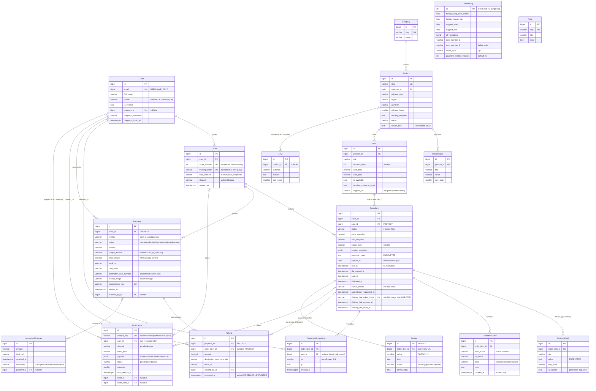

# PremShop — Phase 1 ERD

> **Firmness (owner calibration, 2026-09-01).** This is a contract that hardens incrementally: each model becomes *settled* at the gate of the step that builds it (accounts → S2, catalog → S3, orders → S4a, payments + SiteSetting → S5, notifications → S6, cms → S11). Until then its rows are the best current draft — buildable-from, but revisable at a step gate through a conversation, never silently. Settled from day one regardless of step: status lives on OrderItem with the 7-status list; snapshots at order time; field-level encryption of `DeliveryField.value` and `customer_input`; REFUNDED gated on an executed Refund row; toman storage; append-only `OrderItemEvent`. If building a step shows a drafted table is wrong, the move is stop-and-discuss, not work-around.

All monetary columns are **toman**, `DecimalField(max_digits=12, decimal_places=0)` — `decimal_places=0` enforces integer-valued at the DB level (D3). Rial exists only in the card-to-card instructions template and the future gateway adapter, never in storage. All timestamps are UTC `timestamptz`; Jalali is a render-time concern (core helpers).

Notation below: `Money` = `Decimal(12,0)`, `TS` = `DateTimeField`. "—" in Null column = `NOT NULL`.

---

## 1. Entity-Relationship Diagram



**Phase 2:** `Review` only (D16). Everything else is phase 1.

---

## 2. Models by App

### `core.SiteSetting` — singleton (D8)

| Field | Type | Null | Default | Note |
|---|---|---|---|---|
| id | int PK | — | 1 | `CHECK (id = 1)`; loaded via `SiteSetting.load()` |
| holiday_stop_new_orders | bool | — | false | checkout hard-stop |
| holiday_message | text | blank | "" | shown to customers when stopped |
| holiday_pause_sla | bool | — | false | drives mass pause/resume (D7) |
| support_start | time | — | 10:00 | structured, for SLA math |
| support_end | time | — | 22:00 | |
| off_weekdays | jsonb | — | `[]` | list of weekday ints (e.g. `[4]` = Friday) |
| support_hours_display | varchar(200) | — | | free-text shown on site; independent of the math fields |
| card_number_1 / card_holder_1 | varchar(16) / varchar(100) | — | | destination slot 1 |
| card_number_2 / card_holder_2 | varchar(16) / varchar(100) | blank | "" | destination slot 2 — crisis fallback (blocked personal card) without a deploy (owner ruling) |
| active_card | smallint | — | 1 | `CHECK (active_card IN (1, 2))`; flipping never touches open payments — instructions render from the Payment's snapshot |
| payment_window_minutes | smallint | — | **60** | D8 overrides brief's 30 |

### `accounts.User` — custom, `USERNAME_FIELD = email`

| Field | Type | Null | Default | Note |
|---|---|---|---|---|
| email | citext, unique | — | | citext (or `UniqueConstraint(Lower('email'))`) — case-insensitive login |
| password | varchar(128) | — | | unusable password allowed (OTP-only users, D6) |
| full_name | varchar(150) | blank | "" | |
| phone | varchar(15) | blank | "" | collected at checkout day one; SMS channel is a later decision (D6) |
| is_verified | bool | — | false | set by checkout OTP or Telegram link (D6) |
| telegram_id | bigint, unique | yes | null | one telegram ↔ one user |
| telegram_username | varchar(64) | blank | "" | display only |
| telegram_linked_at | TS | yes | null | non-null = accepted verification channel |
| is_active / is_staff / date_joined / last_login | Django standard | | | is_staff = the operator; no RBAC beyond this |

Login OTPs and Telegram link tokens (5-min TTL) live in **Redis, not tables** — see §5.

### `catalog`

**Category** (flat — no parent, D15)

| Field | Type | Null | Default |
|---|---|---|---|
| name | varchar(100) | — | |
| slug | varchar(100), unique | — | |
| description / intro_html | text | blank | "" |
| seo_title / seo_description | varchar(70)/varchar(160) | blank | "" |
| sort_order | smallint | — | 0 |

**Product**

| Field | Type | Null | Default | Note |
|---|---|---|---|---|
| category | FK Category, **PROTECT** | — | | can't delete a category still holding products |
| name / slug (unique) | varchar(150) | — | | |
| short_description | varchar(300) | blank | "" | |
| full_description | text | blank | "" | rich text |
| image | ImageField | yes | null | |
| delivery_type | varchar(24), choices | — | | `ready_account`·`on_customer_account`·`code_license`·`gift_card` |
| region | varchar(24), choices | — | `global` | must surface in title + checkout confirm (brief §4) |
| warranty | varchar(24), choices | — | `none` | `none`·`days_7`·`full_period` |
| delivery_hours | smallint | — | 24 | promised delivery window; SLA input (D7) |
| delivery_template | text | blank | "" | comma-separated field names; pre-renders delivery form |
| status | varchar(16), choices | — | `draft` | `draft`·`active`·`unavailable` |
| search_text | text | — | "" | normalized (yeh/kaf folding, half-space, digit folding), maintained on save; `icontains` target (D15) |
| seo_title / seo_description | varchar | blank | "" | |
| created_at / updated_at | TS | — | auto | |

**ProductSpec**: `product` FK CASCADE · `title` varchar(100) · `value` varchar(255) · `sort_order` smallint default 0. Admin datalist suggests existing titles (D15).

**Plan**

| Field | Type | Null | Default | Note |
|---|---|---|---|---|
| product | FK Product, CASCADE | — | | cascade halts at OrderItem.plan PROTECT — a product with sold plans is undeletable, which is correct |
| title | varchar(100) | — | | «۱ ماهه» |
| duration_days | int | yes | null | null = no expiry (gift cards); feeds expires_at precompute |
| cost_price | Money | — | | operator-only; copied to cost_snapshot at order time |
| sale_price | Money | — | | |
| is_available | bool | — | true | soft delete; never row-delete a sold plan |
| requires_customer_input | bool | — | false | |
| customer_input_label | varchar(200) | blank | "" | |
| supplier_url | URLField | blank | "" | upstream listing for THIS plan (owner ruling: durations are separate listings upstream); shown on the delivery page's supply column; deliberately NOT copied into product_snapshot — read live via the PROTECTed `OrderItem.plan` FK |
| sort_order | smallint | — | 0 | |

### `orders`

**Order** — no status field; order status is computed from its items (brief §4)

| Field | Type | Null | Default | Note |
|---|---|---|---|---|
| user | FK User, **PROTECT** | — | | financial record; anonymize users, never delete |
| order_number | int, unique | — | sequence | PG sequence starting 1001; human-facing |
| tracking_token | varchar(32), unique | — | `token_urlsafe(16)` | public tracking URL key (D12); no login, no PII exposed |
| total_amount | Money | — | | = sum of item price_snapshots; **no discount field** (D3) |
| channel | varchar(8), choices | — | `web` | `web`·`bot`·`legacy` (launch backfill, D12) |
| created_at | TS | — | auto | |

**OrderItem** — carries the 7-state machine (D1)

| Field | Type | Null | Default | Note |
|---|---|---|---|---|
| order | FK Order, CASCADE | — | | composition; deletion of paid orders is blocked by Payment PROTECT anyway |
| plan | FK Plan, **PROTECT** | — | | plan row must outlive every sale (snapshot has the display data; FK keeps the supply/re-buy link) |
| status | varchar(24), choices | — | `PENDING_PAYMENT` | `PENDING_PAYMENT`·`QUEUED`·`AWAITING_INPUT`·`DELIVERED`·`REPLACEMENT_REQUESTED`·`CANCELLED`·`REFUNDED` |
| price_snapshot | Money | — | | |
| cost_snapshot | Money | — | | copied from Plan.cost_price at order time (D10) |
| actual_cost | Money | yes | null | delivery-form editable, prefilled from cost_snapshot; replacements add to it (D10) |
| product_snapshot | jsonb | — | | name, plan title, region, warranty, specs at purchase time |
| customer_input | **EncryptedTextField** | blank | "" | may contain the customer's own password (D10) |
| delivery_note | text | blank | "" | operator → customer, plaintext non-secret |
| expires_at | date | yes | null | subscription expiry; precomputed from duration_days, editable |
| due_at | TS | yes | null | set at payment confirm via the pure SLA function (D7) |
| sla_paused_at | TS | yes | null | set on QUEUED→AWAITING_INPUT; resume: `due_at += now − sla_paused_at` |
| paid_at | TS | yes | null | denormalized from Payment.confirmed_at; keeps queue/metrics queries join-free |
| delivered_at | TS | yes | null | |
| cancel_reason | varchar(32), choices | yes | null | `expired_unpaid`·`customer_before_payment`·`customer_after_payment`·`supply_failure`·`input_timeout`·`warranty_refund`·`operator` |
| cancellation_requested_at | TS | yes | null | request is not a status (D1); powers queue badge |
| delivery_link_token_hash | char(64), unique | yes | null | SHA-256 of the single-use delivery-link token (ADR-0008); the raw token exists only in the sent message. Issued at A5, regenerated at A10a (old link dead), invalidated at A11 |
| delivery_link_expires_at | TS | yes | null | issue + 72h |
| delivery_link_used_at | TS | yes | null | stamped under the item lock on first open — single-use |
| created_at | TS | — | auto | |

**DeliveryField** — `order_item` FK CASCADE · `title` varchar(100) · `value` **EncryptedTextField** · `sort_order` smallint · `is_current` bool default true · `created_at` TS. Replacement writes a new generation and flips old rows to `is_current=false`; old rows are kept (D10).

**OrderItemEvent** (append-only, D9) — `order_item` FK CASCADE · `from_status` varchar(24) null (null = creation) · `to_status` varchar(24) · `actor` varchar(12) choices `operator`·`customer`·`system` · `note` text blank · `created_at` TS. Written **inside** every transition transaction; the occurrence it records seeds Notification.dedupe_key (D17/D18). No update/delete paths in code.

**CredentialAccessLog** (D9) — `order_item` FK CASCADE · `user` FK User **PROTECT**, **nullable** (a magic-link reveal has no authenticated user — attribution is the redeemed token itself, ADR-0008) · `via` varchar(12) choices `panel`·`magic_link` · `ip` inet · `created_at` TS. One row per reveal, operator included. CASCADE on order_item is safe: items holding credentials are transitively undeletable via Payment PROTECT.

### `payments`

**Payment** — own small machine (D2), separate from the item machine

| Field | Type | Null | Default | Note |
|---|---|---|---|---|
| order | FK Order, **PROTECT** | — | | deleting an order with money history must fail loudly |
| method | varchar(16), choices | — | | `card_to_card`·`gateway` |
| status | varchar(12), choices | — | `pending` | `pending`·`submitted`·`confirmed`·`rejected`·`expired`; expired→confirmed = operator manual match (revive, D2) |
| amount | Money | — | | what is owed (order total at payment creation) |
| unique_amount | Money | yes | null | amount + small random; **card_to_card only, null for gateway** so gateway rows never collide in the partial unique index |
| paid_amount | Money | yes | null | what actually arrived; near-miss delta visible (D11) |
| bank_ref | varchar(64) | blank | "" | |
| card_last4 | varchar(4) | blank | "" | the customer's sending card |
| destination_card_number / destination_card_holder | varchar(16) / varchar(100) | — | | snapshot of the active destination card at creation — the instructions page renders from THIS, immune to a mid-window `active_card` flip; reconciliation shows which card to check |
| receipt_image | FileField | yes | null | **outside public media root**, randomized name, served via authenticated X-Accel-Redirect (D14) |
| idempotency_key | varchar(64), unique | — | | |
| gateway_name / authority / ref_id | varchar(64) | blank | "" | gateway adapter fields, unused at launch |
| expires_at | TS | — | | created_at + payment_window_minutes; the expiry sweep auto-expires **`pending` only** — a `submitted` payment never auto-expires, it waits for operator confirm/reject |
| submitted_at | TS | yes | null | customer claimed paid / uploaded receipt |
| confirmed_at | TS | yes | null | |
| matched_by | FK User, **PROTECT** | yes | null | audit: which operator matched |
| matched_at | TS | yes | null | |
| created_at | TS | — | auto | |

**Refund** (D2) — one row per outbound transfer; refunds are never payment statuses

| Field | Type | Null | Note |
|---|---|---|---|
| payment | FK Payment, **PROTECT** | — | money audit chain |
| order_item | FK OrderItem, **PROTECT** | yes | null = order-level/partial money return not tied to one item |
| amount | Money | — | > 0 |
| destination_card_or_sheba | varchar(34) | blank | collected before execution, like bank_ref — the 21-day input-timeout auto-cancel (ADR-0009) creates the row blank; execution requires it non-empty (service-enforced) |
| bank_ref | varchar(64) | blank | filled at execution |
| note | text | blank | |
| created_by | FK User, **PROTECT** | — | |
| created_at / executed_at | TS / TS null | | non-null executed_at is the service-enforced gate for CANCELLED→REFUNDED |

**UnmatchedTransfer** (D9) — `amount` Money · `bank_ref` varchar(64) · `received_at` TS · `note` text blank · `resolution` varchar(12) choices `matched`·`refunded`·`kept`, **null = open** · `payment` FK Payment SET_NULL null (link once matched; ledger row survives regardless) · `created_at` TS.

### `notifications`

**Notification** (outbox, D17)

| Field | Type | Null | Default | Note |
|---|---|---|---|---|
| dedupe_key | varchar(128), unique | — | | `{occurrence}:{recipient}:{channel}`, recipient = user id or literal `op` — e.g. `order:1041:created:op:telegram`, `renew7:5512:2026-10-01:8:email`. Unique per occurrence, so post-replacement re-delivery notices are legal; renewal keys include expires_at, so extending expires_at re-arms the reminder |
| user | FK User, CASCADE | yes | null | **null = operator alert** (goes to operator chat_id/email from settings) |
| channel | varchar(12), choices | — | | `email`·`telegram` |
| event_type | varchar(48) | — | | `order.created`, `payment.confirmed`, `item.delivered`, `item.awaiting_input`, `item.supply_delayed`, `item.replaced`, `item.replacement_rejected`, `expiry.d7`, `expiry.d0`, … (canonical registry lives in the state-machine doc) |
| payload | jsonb | — | `{}` | content-free re credentials: order number + panel link only (D13) |
| order / order_item | FK, SET_NULL | yes | null | both nullable (D17); history survives cleanup |
| status | varchar(12), choices | — | `pending` | `pending`·`sent`·`failed` (failed = retries exhausted, terminal) |
| attempts | smallint | — | 0 | |
| next_attempt_at | TS | yes | null | exponential backoff |
| last_error | text | blank | "" | |
| created_at / sent_at | TS / TS null | | |

Rows are enqueued by `events.emit()` via `transaction.on_commit` (D18). Beat also pings the external dead-man heartbeat (D17) — no table needed.

### `cms`

**Page** — `slug` varchar(100) unique · `title` varchar(200) · `body` text (rich) · `seo_title` varchar(70) blank · `seo_description` varchar(160) blank · `created_at`/`updated_at`. Terms, refund policy, privacy, about/contact — Enamad prerequisites, panel-editable.

**FAQ** — `product` FK Product CASCADE **null** (null = site-wide FAQ page; set = product-page block) · `question` varchar(300) · `answer` text · `sort_order` smallint · `is_published` bool default true.

### `reviews` (PHASE 2, D16)

**Review** — `order_item` OneToOne CASCADE (unique ⇒ one review per delivered item) · `rating` smallint · `body` text · `status` varchar(12) `pending`·`approved`·`rejected` default pending · `admin_reply` text blank · `created_at` · `moderated_at` TS null. Verified-buyer enforced in the service (item must be DELIVERED and owned by the requester). No helpful_count, no voting, no automated scanning — moderation UI carries the leaked-credential reminder line instead.

---

## 3. Constraints

### Unique

| Model | Constraint |
|---|---|
| User | `email`; `telegram_id` (nullable — PG ignores NULLs) |
| Category / Product / Page | `slug` |
| Order | `order_number`; `tracking_token` |
| Payment | `idempotency_key` |
| Notification | `dedupe_key` |
| Review | `order_item_id` (OneToOne) |
| OrderItem | `delivery_link_token_hash` (nullable — PG ignores NULLs) |
| SiteSetting | singleton via check below |

### Partial unique (exact predicates, D11)

```sql
-- no two live payments may share a matching amount
CREATE UNIQUE INDEX payment_uniq_active_amount
  ON payments_payment (unique_amount)
  WHERE status IN ('pending', 'submitted');

-- one live payment per order
CREATE UNIQUE INDEX payment_uniq_active_order
  ON payments_payment (order_id)
  WHERE status IN ('pending', 'submitted');
```

(Django `UniqueConstraint(fields=[...], condition=Q(status__in=['pending','submitted']))`.) Allocation of `unique_amount` is retry-on-`IntegrityError`; the 72h no-reuse rule after expiry is a **service-level** check — expired rows leave the index, so the index only backstops concurrent live payments (per D11).

### Check constraints

| Model | Constraint |
|---|---|
| SiteSetting | `CHECK (id = 1)`; `active_card IN (1, 2)` |
| Product | `delivery_hours BETWEEN 1 AND 48`; `status IN ('draft','active','unavailable')` |
| Plan | `cost_price >= 0 AND sale_price >= 0`; `duration_days IS NULL OR duration_days > 0` |
| Order | `total_amount >= 0`; `channel IN ('web','bot','legacy')` |
| OrderItem | `status IN (…7 values…)`; `price_snapshot >= 0 AND cost_snapshot >= 0`; `actual_cost IS NULL OR actual_cost >= 0`; `cancel_reason IS NULL OR cancel_reason IN (…7 values…)`; `status NOT IN ('CANCELLED','REFUNDED') OR cancel_reason IS NOT NULL` — a cancellation can never lose its reason |
| Payment | `status IN (…5 values…)`; `method IN ('card_to_card','gateway')`; `amount >= 0`; `unique_amount IS NULL OR unique_amount >= amount` (unique amount = amount + small positive suffix); `method <> 'card_to_card' OR unique_amount IS NOT NULL`; `paid_amount IS NULL OR paid_amount >= 0` |
| Refund | `amount > 0` |
| UnmatchedTransfer | `amount > 0`; `resolution IS NULL OR resolution IN ('matched','refunded','kept')` |
| Notification | `attempts >= 0`; `channel IN ('email','telegram')`; `status IN ('pending','sent','failed')` |
| Review (ph2) | `rating BETWEEN 1 AND 5`; `status IN ('pending','approved','rejected')` |

Transition legality (the matrix itself) is service-enforced with `select_for_update()` — a check constraint can see the target state but not the edge.

### FK `on_delete` summary

| FK | on_delete | Rationale |
|---|---|---|
| Order.user, Payment.order, Refund.payment, Refund.order_item, Refund.created_by, Payment.matched_by, CredentialAccessLog.user | **PROTECT** | anything in the money/audit chain must fail loudly on delete; users/orders are anonymized, never deleted |
| OrderItem.plan | **PROTECT** | a sold plan row must exist forever; retire with `is_available=false`. Snapshot covers display, the FK keeps the profit/re-buy/renewal link live |
| Product.category | **PROTECT** | no orphan products; empty the category first |
| OrderItem.order; DeliveryField / OrderItemEvent / CredentialAccessLog .order_item; ProductSpec / Plan / FAQ .product; Review.order_item; Notification.user | CASCADE | pure children. Every credential-bearing chain is transitively PROTECTed through Payment, so CASCADE here can only ever fire on unpaid/draft data |
| Notification.order, Notification.order_item; UnmatchedTransfer.payment | SET_NULL | history/ledger rows must survive their subject (D17) |

---

## 4. Indexes beyond PKs/uniques

Django auto-indexes every FK; those cover the per-item timeline (`OrderItemEvent.order_item`), reveal log, delivery fields, "my orders" (`Order.user`), and item lists without further work.

| Index | Named query it serves |
|---|---|
| `OrderItem (status, due_at)` | Operator queue tabs: `WHERE status = 'QUEUED' ORDER BY due_at ASC` (default tab, D-brief §8); same index serves the AWAITING_INPUT tab, the stats bar counts, and the overdue-order alarm scan (`status='QUEUED' AND due_at < now()`) |
| Partial `OrderItem (expires_at) WHERE status = 'DELIVERED' AND expires_at IS NOT NULL` | Daily renewal-reminder beat: items expiring in 7 days / today — scans only live subscriptions, skips the whole non-delivered and non-expiring population |
| Partial `Payment (expires_at) WHERE status = 'pending'` | Payment-expiry beat task (`expires_at < now()` → `expired`) — sweeps `pending` only per R6; `submitted` never auto-expires. Index is empty except for the handful of live payments |
| Partial `Notification (next_attempt_at) WHERE status = 'pending'` | Outbox worker poll: `WHERE status='pending' AND next_attempt_at <= now() ORDER BY next_attempt_at` |

The two partial-unique payment indexes in §3 double as the manual-match lookup ("this amount belongs to which order").

**Deliberately unindexed:** `Product.search_text` (icontains can't use btree; catalog is a few dozen rows — seq scan is free; pg_trgm is the upgrade path if the catalog ever grows 100×), and operator panel search fields (`bank_ref`, customer name — at <1 order/day every table involved is thousands of rows at most; add on measured slowness, not speculation).

---

## 5. Deliberately NOT modeled

| Absent | Why |
|---|---|
| Cart | D5 — buy-now checkout; Order/OrderItem stay fully multi-item, so a cart later is a view/template change, not a schema change |
| Coupon / Discount | D3 cut `Order.discount`; no mechanism exists — out of scope until one does |
| Supplier / FX rate | one upstream marketplace, manual pricing; `cost_snapshot`/`actual_cost` capture what matters (profit) without modeling why |
| Inventory / stock | nothing delivers instantly; `Product.status='unavailable'` is the whole stock model |
| RBAC / roles | one operator = `is_staff`; a second role would be the trigger to add it |
| Identity tables (EmailIdentity/TelegramIdentity) | brief §19-الف resolved to flat fields on User; splitting is a mechanical migration if a third login method ever appears |
| Wallet / ledger | brief out-of-scope; if it comes, it arrives double-entry from day one |
| Ticket system | email + Telegram suffice |
| OTP codes / Telegram link tokens | 5-minute TTL values — Redis with expiry, not rows needing a cleanup job |
| Queue soft-lock (`locked_by`/`locked_at`) | brief cut the logic for one operator; adding the two columns later is a trivial additive migration |

---

## Concerns

1. **Second destination card — RESOLVED at owner review:** two slots + `active_card` selector on SiteSetting, and Payment snapshots the shown card at creation (see the Payment table). Slot 2 may start empty; the physical card is obtained by the S12 gate.
2. **Operator-alert recipient.** D17 specifies the outbox's order/order_item FKs but not the recipient column. Modeled as nullable `Notification.user` with NULL meaning "operator channels from settings". Flagging the interpretation so it doesn't pass silently.
3. **Refund.order_item NULL vs the REFUNDED gate.** A NULL-item Refund (order-level partial money return, D2) can never satisfy D1's "no item enters REFUNDED without an executed Refund row" for any specific item. Consistent as long as the service requires an item-linked Refund whenever the intent is moving that item to REFUNDED; NULL-item refunds are for money-only returns (overpayment, UnmatchedTransfer resolution). Pinning that reading here.
4. **`unique_amount` made nullable** (gateway payments), a small extension of D11: the partial unique index is on `unique_amount` regardless of method, so two concurrent gateway payments with equal amounts would otherwise collide. NULLs escape the index; a check constraint still forces the value for card-to-card.
