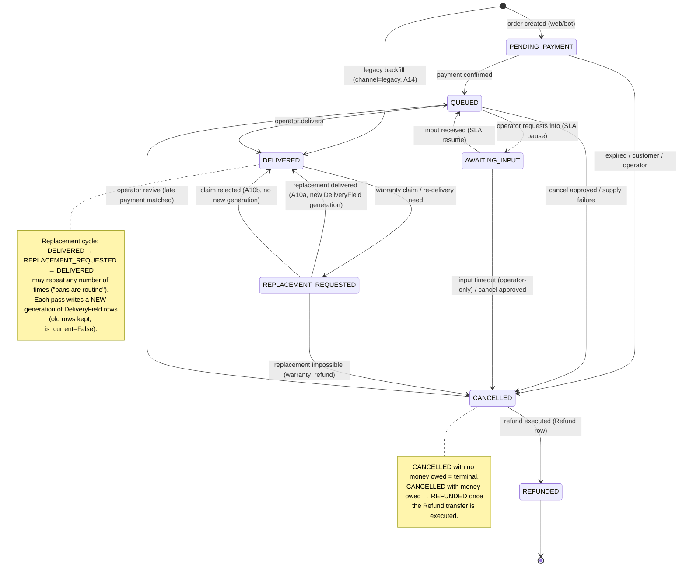
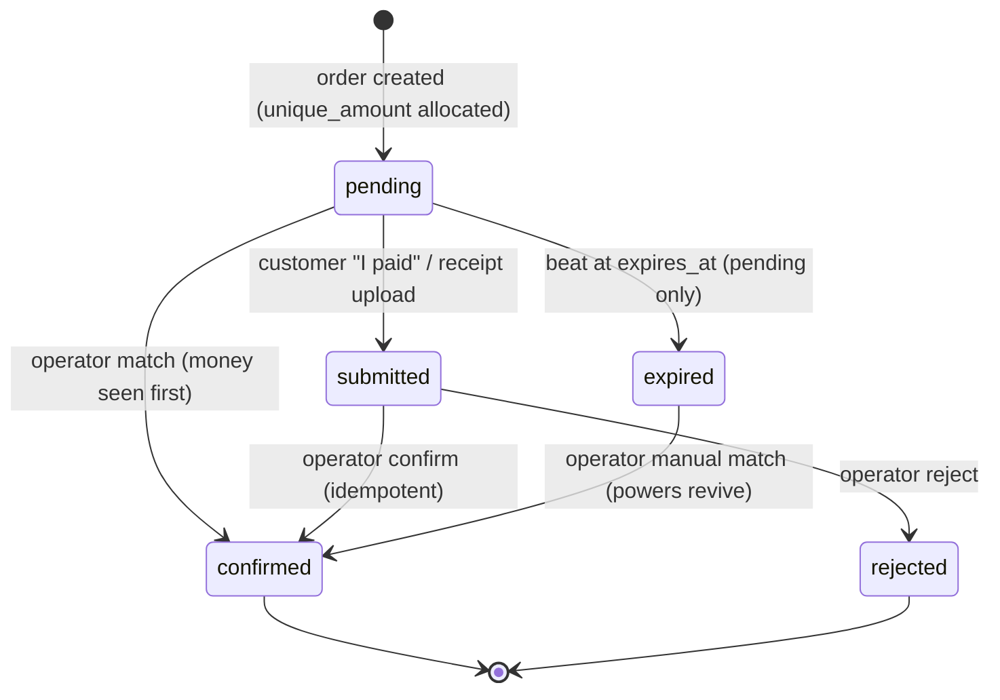

# PremShop — State Machine Specification

> **Firmness (owner calibration, 2026-09-01).** Settled now: the 7-status list, transitions only through services, illegal transitions raise, the executed-Refund gate on REFUNDED, and the event-row-inside-the-transaction rule. The per-transition guards/side-effects and the event catalog harden at the step that implements them (item machine → S4a, payment machine → S5, notification consumers → S6/S8); until then they are the best current draft. A mid-step discovery that a row here is wrong is a contract conversation, not a workaround.

Scope: OrderItem machine, Payment machine, event catalog, concurrency rules, test list. Implements decisions D1–D2, D7–D11, D17–D18 exactly. All transitions live in `orders/services.py` and `payments/services.py`; any status write outside a service method is a code-review reject.

Conventions used below:

- `PP` = PENDING_PAYMENT, `Q` = QUEUED, `AI` = AWAITING_INPUT, `DEL` = DELIVERED, `RR` = REPLACEMENT_REQUESTED, `CAN` = CANCELLED, `REF` = REFUNDED.
- Every allowed transition: runs inside `transaction.atomic()` with `select_for_update()` on the row, validates the (from, to) pair against this matrix, raises `InvalidTransition` otherwise, writes one `OrderItemEvent` row **inside** the transaction, and calls `events.emit(...)` via `transaction.on_commit()`.
- `compute_due_at(confirmed_at, delivery_hours, schedule)` is the single pure SLA function (D7): wall-clock add, snap **forward** to next support window if outside one, hard cap `confirmed_at + 48h`. The cap applies at computation time only; SLA pauses may legitimately push `due_at` past it.

---

## 1. OrderItem machine

### 1.1 Diagram

### 1.2 Transition grid (every ordered pair)

Rows = from, columns = to. `A#` = allowed, detailed in §1.3. Forbidden cells carry the one-word reason.

| from \ to | PP | Q | AI | DEL | RR | CAN | REF |
|---|---|---|---|---|---|---|---|
| **(creation)** | **A1** | unpaid | unpaid | **A14**² | unpaid | unpaid | unpaid |
| **PP** | no-op | **A2** | unpaid | unpaid | unpaid | **A3** | via-CANCELLED |
| **Q** | paid | no-op | **A4** | **A5** | undelivered | **A6** | via-CANCELLED |
| **AI** | paid | **A7** | no-op | resume-first | undelivered | **A8** | via-CANCELLED |
| **DEL** | paid | via-replacement | via-replacement | no-op¹ | **A9** | via-replacement | via-CANCELLED |
| **RR** | paid | loop-only | loop-only | **A10a/A10b** | no-op | **A11** | via-CANCELLED |
| **CAN** | revive-to-QUEUED | **A13** | revive-to-QUEUED | revive-first | undelivered | no-op | **A12** |
| **REF** | terminal | terminal | terminal | terminal | terminal | terminal | no-op |

¹ Re-delivery is never a DELIVERED→DELIVERED self-transition; it always goes through the A9→A10a loop, even for an operator-side correction (wrong password typed). This keeps every credential generation attributable to an explicit request event.

² Legacy backfill only: creation → DELIVERED is legal solely via the backfill service for `Order.channel='legacy'` (actor system) — see A14. Web/bot orders always start at PP.

Forbidden-reason glossary: **unpaid** = payment not confirmed; **paid** = money already taken, cannot regress to pre-payment; **undelivered** = replacement states only make sense after a delivery; **resume-first** = must return to QUEUED (restoring the SLA clock) before delivering; **via-replacement** = post-delivery problems route through REPLACEMENT_REQUESTED only (brief: "پس از تحویل: فقط از مسیر گارانتی و تعویض"); **via-CANCELLED** = REFUNDED is only reachable from CANCELLED with an executed Refund row (D2); **loop-only** = RR resolves only to DELIVERED or CANCELLED; **revive-to-QUEUED** = the only exit from CANCELLED besides REFUNDED is the operator revive, and it lands on QUEUED because it is guarded by a confirmed payment; **terminal** = REFUNDED is final; **no-op** = self-transitions are forbidden (holiday SLA annotations and `orders.extend_due_at` write an `OrderItemEvent` with `from_status == to_status` but are not status transitions — see §4.6 and below).

Not a transition (by decision D1): a customer cancellation **request** on a Q/AI item sets `cancellation_requested_at`, emits `item.cancellation_requested`, shows a queue badge; the item's status does not change until the operator approves (A6/A8).

Also not a transition: `orders.extend_due_at(*, item, new_due_at, note, actor='operator')` — legal only in QUEUED; writes an annotation `OrderItemEvent` (`from_status == to_status == QUEUED`, note) and emits `item.supply_delayed` (customer delay notice, C6). This service, `compute_due_at`, and the pause/resume arithmetic (§4.6) are the **only** writers of `due_at`.

### 1.3 Allowed transitions — detail

| # | Transition | Trigger | Actor | Guards | Side effects (all in one transaction unless noted) | Event emitted (on commit) |
|---|---|---|---|---|---|---|
| **A1** | creation → PP | Checkout submits (or bot order) — the view calls only `payments.checkout(user, plan, quantity, customer_input, phone) -> tuple[Order, Payment]`, which runs `orders.place_order` + `start_card_payment` in ONE transaction | customer | Plan `is_available`; product active; `holiday_stop_new_orders` off; price computed server-side | OrderItem rows created with `price_snapshot`, `product_snapshot`, `cost_snapshot` (from `Plan.cost_price`), encrypted `customer_input` if collected; Payment created in the same transaction (see P-A1); `OrderItemEvent(NULL→PP, actor)` per item | `order.created` (one per order, not per item) |
| **A2** | PP → Q | Payment reaches `confirmed` (operator confirm; later gateway verify) | system (invoked from payment service) | Item's order's payment is `confirmed`. Called only from `payments.services.confirm_payment` — never directly | `paid_at = payment.matched_at`; `due_at = compute_due_at(paid_at, product.delivery_hours, schedule)`; `OrderItemEvent(PP→Q, system)` | none — customer messaging rides on `payment.confirmed`, emitted exactly once by `payments.confirm_payment` (`orders.mark_order_paid` emits nothing) |
| **A3** | PP → CAN | (a) beat task at payment expiry; (b) customer cancels unpaid order; (c) operator cancels | system / customer / operator | (a) payment `expired`; (b) item belongs to `request.user`; (c) staff | `cancel_reason` = `expired_unpaid` \| `customer_before_payment` \| `operator`; payment expired via P-A6 in the same service call when applicable; `OrderItemEvent(PP→CAN, actor, note=reason)` | `item.cancelled` (customer notification suppressed for `expired_unpaid` — `payment.expired` already notifies) |
| **A4** | Q → AI | Operator clicks «درخواست اطلاعات» on the delivery page, with a note | operator | Staff; note non-empty | `sla_paused_at = now()` **only if currently NULL** (may already be holiday-paused, §4.6); `OrderItemEvent(Q→AI, operator, note)` | `item.awaiting_input` |
| **A5** | Q → DEL | Operator clicks «تایید و ارسال به مشتری» on the delivery form | operator | Staff; all required delivery fields present; `sla_paused_at IS NULL` (holiday-paused items must be resumed first — delivering while "paused" would corrupt the resume arithmetic) | DeliveryField rows written (encrypted, `is_current=True`, generation 1); `delivered_at = now()`; `expires_at` set (prefilled from `duration_days`, editable); `actual_cost` saved (prefilled from `cost_snapshot`, editable); delivery-link token issued (≥128-bit random, stored **hashed**, 72h, single-use — D13 as amended, ADR-0008); `OrderItemEvent(Q→DEL, operator)` | `item.delivered` (no credential values; carries the single-use delivery link) |
| **A6** | Q → CAN | Operator approves a cancellation request, or records supply failure, or cancels unilaterally | operator | Staff | `cancel_reason` = `customer_after_payment` \| `supply_failure` \| `operator`; Refund row **created** (not executed) in same transaction when money was taken — via `payments.cancel_with_refund` (see note below the table); `sla_paused_at` cleared; `OrderItemEvent(Q→CAN, operator, note)` | `item.cancelled` |
| **A7** | AI → Q | Customer submits the requested info on their order page, or operator marks resolved | customer / operator | Customer: item ownership (`order.user_id == request.user.id`); input non-empty | `customer_input` updated (encrypted); **SLA resume: `due_at += (now() − sla_paused_at)`; `sla_paused_at = NULL`** — unless holiday pause is still active, in which case `sla_paused_at = now()` immediately after (see §4.6); `OrderItemEvent(AI→Q, actor)` | `item.input_received` |
| **A8** | AI → CAN | Operator cancels/approves at any point; OR the input-timeout ladder ends it — beat re-reminds at 48h, flags the queue at 7 days, sends the automated **final warning naming the deadline at 14 days**, and at **21 days system auto-cancels** (owner-review revision, supersedes the human-only rule; anchor = the AI-entry OrderItemEvent; holiday does not pause the ladder) | operator / system (21-day ladder end only) | Staff; or beat past day 21 since entering AI | `cancel_reason` = `input_timeout` \| `customer_after_payment` \| `operator`; Refund row created if money taken (via `payments.cancel_with_refund` — destination may be blank at creation, collected from the customer before execution); `sla_paused_at` cleared; `OrderItemEvent(AI→CAN, actor)` | `item.cancelled` |
| **A9** | DEL → RR | Customer files a warranty/replacement claim on their order page; or operator opens one (ban discovered, own typo, or a direct warranty refund — DEL→CAN stays forbidden, so the refund route is DEL→RR→CAN via A9+A11) | customer / operator | Customer: ownership + product warranty allows a claim (warranty ≠ «بدون» and within warranty window); operator: staff, no warranty guard | `OrderItemEvent(DEL→RR, actor, note=claim text)` | `item.replacement_requested` |
| **A10a** | RR → DEL (redeliver) | Operator delivers the replacement on the same delivery form | operator | Staff; new delivery fields provided | Current DeliveryField rows set `is_current=False` (kept); new generation written `is_current=True`; `actual_cost` updated (replacement cost added — prefilled, editable); `expires_at` editable; **`delivered_at` is NOT changed** (first-delivery anchor; replacement timing lives in OrderItemEvent); delivery-link token regenerated (previous link dead); `OrderItemEvent(RR→DEL, operator)` | `item.replaced` → customer notice; fires per replacement pass — new `OrderItemEvent.id` ⇒ new outbox `dedupe_key` (D17) |
| **A10b** | RR → DEL (reject claim) | Operator rejects the replacement claim («رد درخواست تعویض») — service `orders.reject_replacement` | operator | Staff; **note required** | **NO new DeliveryField generation** — the current generation stays untouched; `OrderItemEvent(RR→DEL, operator, note)` | `item.replacement_rejected` → customer notice |
| **A11** | RR → CAN | Operator: replacement impossible, warranty refund | operator | Staff | `cancel_reason = warranty_refund`; Refund row created (executed later); superseded DeliveryField rows untouched; delivery-link token invalidated; `OrderItemEvent(RR→CAN, operator, note)` | `item.cancelled` |
| **A12** | CAN → REF | Operator marks the refund transfer as executed (`executed_at`, `bank_ref` on the Refund row) | operator | **Service-enforced (D2): an executed Refund row (`executed_at NOT NULL`) referencing this item — directly via `order_item` FK, or order-wide (`order_item IS NULL`) on this order's payment — must exist. No row ⇒ `InvalidTransition`.** | `OrderItemEvent(CAN→REF, operator, note=bank_ref)` | `item.refunded` |
| **A13** | CAN → Q | Operator "revive": late card-to-card money matched to the expired payment | operator | Staff; the order's payment is now `confirmed` (via P-A8 manual match, same service call); item's `cancel_reason ∈ {expired_unpaid, input_timeout, supply_failure, operator}` **AND no unexecuted Refund row (`executed_at IS NULL`) references the item** — never revive a refunded-path or refund-owed item. The guard lives inside `payments.revive_order`; there is no caller-supplied `has_pending_refund` boolean anywhere | `cancel_reason = NULL`; `cancellation_requested_at = NULL`; `paid_at = payment.matched_at`; `due_at = compute_due_at(matched_at, delivery_hours, schedule)` (fresh SLA); `OrderItemEvent(CAN→Q, operator, note="revive")` | none (customer messaging rides on `payment.confirmed` with `matched_manually`) |
| **A14** | creation → DEL | Legacy backfill service only (`Order.channel='legacy'`) | system | Backfill service; channel is `legacy` — any other channel raises | `OrderItemEvent(NULL→DEL, system, note='backfill')`; **no Payment rows created, no notifications sent** | none |

Service composition: cancels of **paid** items (A6/A8/A11 with money taken) are invoked through `payments.cancel_with_refund(item, reason, refund_destination, amount, note, actor)` — one composite service that wraps `orders.cancel(...)` + the Refund-row creation atomically, so the panel view calls exactly one service (one-service-per-view). `orders.cancel` itself never touches Refund and is called directly only for unpaid items. Checkout and revive have the same shape: `payments.checkout(...)` (A1/P-A1) and `payments.revive_order(payment) -> Order` (P-A8 + A13).

---

## 2. Payment machine

Statuses: `pending`, `submitted`, `confirmed`, `rejected`, `expired`. Refunds are **not** payment statuses (D2) — the Refund model records each outbound transfer and drives A12 above.

### 2.1 Diagram

### 2.2 Transition grid

| from \ to | pending | submitted | confirmed | rejected | expired |
|---|---|---|---|---|---|
| **(creation)** | **P-A1** | unclaimed | unverified | unclaimed | premature |
| **pending** | no-op | **P-A2** | **P-A3** | nothing-to-reject | **P-A6** |
| **submitted** | one-way | no-op² | **P-A4** | **P-A5** | awaiting-review |
| **confirmed** | terminal | terminal | **idempotent no-op³** | terminal | terminal |
| **rejected** | terminal | terminal | terminal | no-op | terminal |
| **expired** | terminal | terminal | **P-A8** | terminal | no-op |

² Customer re-submitting a receipt while `submitted` updates `receipt_image`/`bank_ref` in place — a field update, not a transition, no event.
³ Calling `confirm_payment` on an already-`confirmed` payment returns success, changes nothing, emits nothing, transitions no items. See §2.3 P-A4.

**awaiting-review** = a `submitted` payment NEVER auto-expires — the expiry sweep is pending-only. Once the customer has claimed payment, the payment waits for the operator's confirm (P-A4) or reject (P-A5); reject is the exit. The customer «منقضی شد» message therefore only ever reaches silent non-payers who never claimed payment.

### 2.3 Allowed transitions — detail

| # | Transition | Trigger | Actor | Guards | Side effects | Event |
|---|---|---|---|---|---|---|
| **P-A1** | creation → pending | Order creation service (A1) | system | **unique_amount allocation:** `amount + random(100..999)` toman; insert; on `IntegrityError` from the partial unique index (`unique_amount WHERE status IN ('pending','submitted')`) retry with a new suffix, max 10 tries. Service also skips any amount used by a payment expired < 72h ago (index is the backstop). Partial unique on `order_id WHERE status IN ('pending','submitted')` forbids two live payments per order. `idempotency_key` generated, UNIQUE. | `expires_at = now() + SiteSetting.payment_window_minutes` (default 60); `OrderItemEvent`: none (payment-side) | none (`order.created` covers it) |
| **P-A2** | pending → submitted | Customer clicks «پرداخت کردم» / uploads receipt on the instructions page | customer | Ownership; `now() < expires_at`; receipt file type/size validated | `submitted_at = now()`; `receipt_image`, `card_last4`, optional `bank_ref` saved | `payment.submitted` |
| **P-A3** | pending → confirmed | Operator matches an incoming transfer before the customer pressed anything | operator | Staff; `paid_amount` entered | Same effects as P-A4 | `payment.confirmed` |
| **P-A4** | submitted → confirmed | Operator clicks «تایید پرداخت» in the payment-confirmation tab | operator | Staff. **Idempotency:** under `select_for_update`, if status is already `confirmed` → return the payment unchanged, emit nothing (double-click / two tabs / retried HTMX request all land here) | `paid_amount` recorded (may differ from `unique_amount`; small shortfall accepted, delta shown in panel — no hard guard); `bank_ref`, `matched_by = request.user`, `matched_at = now()`; **in the same transaction, every PP item of the order runs A2 (PP→Q)** | `payment.confirmed` (single emitter: `payments.confirm_payment`; items transition with no per-item event) |
| **P-A5** | submitted → rejected | Operator rejects (fake/unmatched receipt) | operator | Staff; note required | Rejection note stored; **the order's PP items are cancelled in the same service call (A3, `cancel_reason=operator`, note carries the rejection)** — a rejected payment must not leave items dangling (see Concerns) | `payment.rejected` |
| **P-A6** | pending → expired | Beat task sweep past `expires_at` — **status='pending' only**; `submitted` is exempt (awaiting-review, §2.2) | system | Re-check `expires_at < now()` and status under lock (race vs. P-A2/P-A3); a submission or confirm that won the race makes this a skip, not an error | `unique_amount` freed logically (72h quarantine, P-A1); order's PP items → A3 (`expired_unpaid`) in same transaction | `payment.expired` |
| **P-A8** | expired → confirmed | Operator manual match: late transfer identified (often starting from an UnmatchedTransfer row) | operator | Staff; `paid_amount` entered; if resolving an UnmatchedTransfer, set its `resolution=matched`, `payment` FK | Same fields as P-A4; orchestrated by `payments.revive_order(payment) -> Order` — ONE transaction: P-A8 + A13 for every item passing the revive guard (guard enforced inside the service, see A13) | `payment.confirmed` (with `matched_manually=true`) |

---

## 3. Event catalog

`events.emit(name, payload)` runs in `transaction.on_commit`; its only job is creating Notification outbox rows (D18). `OrderItemEvent` rows (the audit trail / public timeline) are written **inside** the transaction and are independent of this catalog. Customer channels: email always; Telegram additionally when linked. Operator alerts: **both** Telegram and email (D17). All customer-facing texts carry no credential values (D13); delivery/replacement notices additionally carry the single-use 72h delivery link — a bearer capability, not content — scrubbed from Sentry and truncated in access logs (ADR-0008). Auth OTP sends are not domain events — they go straight through the channel senders (they must be immediate and never deduped). Dedupe keys follow one rule: `{occurrence}:{recipient}:{channel}`, where recipient is the user id or the literal `op` (operator). Transitions that notify emit an event; transitions that don't, don't — there are no consumer-less events. This catalog is the canonical event registry across all plan artifacts.

| Event | Emitted by | Payload fields | Notifications (recipient · channels · gist) | Dedupe key |
|---|---|---|---|---|
| `order.created` | A1 | `order_id, order_number, channel, total_amount, item_ids` | operator · TG+email · «سفارش جدید #۱۰۴۱ — ۱٬۲۰۰٬۰۰۰ تومان» | `order:{order_id}:created:op:{ch}` |
| `payment.submitted` | P-A2 | `payment_id, order_id, unique_amount, card_last4` | operator · TG+email · receipt awaiting match | `pay:{payment_id}:submitted:op:{ch}` |
| `payment.confirmed` | P-A3/4/8 — all via `payments.confirm_payment`, the **single** emitter (`orders.mark_order_paid` emits nothing) | `payment_id, order_id, paid_amount, matched_manually` | customer · email+TG · «پرداخت شما تایید شد» (+ "back in queue" variant when `matched_manually`) | `pay:{payment_id}:confirmed:{user_id}:{ch}` (safe: confirm is once-only) |
| `payment.rejected` | P-A5 | `payment_id, order_id, note` | customer · email+TG · problem with receipt, contact support | `pay:{payment_id}:rejected:{user_id}:{ch}` |
| `payment.expired` | P-A6 (pending only — never reaches a customer who claimed payment) | `payment_id, order_id` | customer · email+TG · window expired + retry link | `pay:{payment_id}:expired:{user_id}:{ch}` |
| `item.awaiting_input` | A4 | `item_event_id, item_id, note` | customer · email+TG · info needed + order-page link (`/orders/{order_number}/`); SLA-paused notice | `evt:{item_event_id}:{user_id}:{ch}` |
| `item.input_received` | A7 | `item_event_id, item_id` | operator · TG+email · customer replied, item back in queue | `evt:{item_event_id}:op:{ch}` |
| `item.delivered` | A5 | `item_event_id, item_id, order_number, delivery_link` | customer · email+TG · «سفارش #۱۰۴۱ تحویل شد» + single-use delivery link + order-page link — **no credential values ever** | `evt:{item_event_id}:{user_id}:{ch}` |
| `item.replaced` | A10a | `item_event_id, item_id, order_number, delivery_link` | customer · email+TG · replacement delivered (fresh delivery link; old one dead), no credential values. Fires per replacement pass (new `item_event_id` ⇒ new key — the reason D17 rejected `unique_together`) | `evt:{item_event_id}:{user_id}:{ch}` |
| `item.replacement_rejected` | A10b | `item_event_id, item_id, note` | customer · email+TG · claim reviewed, not accepted + order-page link | `evt:{item_event_id}:{user_id}:{ch}` |
| `item.replacement_requested` | A9 | `item_event_id, item_id, claim_note` | operator · TG+email | `evt:{item_event_id}:op:{ch}` |
| `item.cancellation_requested` | field-set action (not a transition) | `item_id, requested_at` | operator · TG+email | `cancelreq:{item_id}:{requested_at}:op:{ch}` |
| `item.cancelled` | A3/6/8/11 | `item_event_id, item_id, cancel_reason` | customer · email+TG, template per reason; **suppressed** when `cancel_reason=expired_unpaid` (`payment.expired` already told them) | `evt:{item_event_id}:{user_id}:{ch}` |
| `item.refunded` | A12 | `item_event_id, item_id, refund_id, amount, bank_ref` | customer · email+TG · refund sent + bank ref | `evt:{item_event_id}:{user_id}:{ch}` |
| `item.supply_delayed` | `orders.extend_due_at` (annotation — item stays QUEUED) | `item_id, new_due_at, note` | customer · email+TG · delay notice (C6) | `delay:{item_id}:{new_due_at_iso}:{user_id}:{ch}` |
| `item.input_final_warning` | 14-day ladder beat (item still AI) | `item_id, deadline_at` | customer · email+TG · final warning: respond by {deadline} or the order is cancelled and refunded | `remind:{item_id}:14d:{user_id}:{ch}` |
| `auth.otp_signin` | `accounts.verify_otp`, only when the account has a usable password (login page or checkout-inline — ADR-0012) | `user_id, ts, surface` | customer · email + TG-if-linked · new sign-in via one-time code; "change your password if this wasn't you" | `signin:{user_id}:{ts_iso}:{user_id}:{ch}` |
| `sla.holiday_paused` / `sla.holiday_resumed` | holiday mass action (§4.6) | `item_id, paused_at/resumed_at` | customer · email+TG · `SiteSetting.holiday_message` / back-to-work notice | `hpause:{item_id}:{date_iso}:{user_id}:{ch}` / `hresume:{item_id}:{date_iso}:{user_id}:{ch}` |
| `subscription.expiring_soon` | daily beat (7 days out) | `item_id, expires_at, product_slug` | customer · TG+email · renewal reminder + direct repurchase link | `renew7:{item_id}:{expires_at}:{user_id}:{ch}` (key includes `expires_at`, so a later extension re-arms the reminder) |
| `subscription.expired` | daily beat (day of) | same | customer · TG+email · second reminder | `renew0:{item_id}:{expires_at}:{user_id}:{ch}` |
| `items.overdue_digest` | hourly beat scan of `due_at`, **support hours only** | `item_ids, count` | operator · TG+email · «N سفارش گذشته از مهلت» — ONE hourly digest, the only overdue cadence (no per-item or per-day variants) | `overdue:{date_iso}T{hour}:op:{ch}` |

---

## 4. Concurrency rules

**4.1 Lock scope and ordering.** Every item transition: `SELECT ... FOR UPDATE` on that OrderItem only. Every payment transition: `FOR UPDATE` on the Payment, and when it cascades to items (P-A4/5/6/8 + revive), lock the Payment **first**, then its OrderItems ordered by `pk` — one consistent lock order, no deadlocks. Never lock the Order row (nothing transitions on it).

**4.2 Transaction boundary.** One `transaction.atomic()` per user-visible action, even when it spans machines: "confirm payment" = payment P-A4 + N × item A2 + N+1 OrderItemEvent-adjacent writes, all-or-nothing. "Revive" = `payments.revive_order(payment)`: P-A8 + the A13s of every guard-passing item, one transaction. "Cancel with refund" = `payments.cancel_with_refund`: item cancel + Refund-row creation, one transaction. "Checkout" = `payments.checkout`: `orders.place_order` + `start_card_payment`, one transaction. DeliveryField writes and generation supersession (A10a) are inside the delivery transaction.

**4.3 Validate-under-lock.** Status is re-read after acquiring the lock and validated against the matrix there — never trusted from the form/page that rendered the button. `InvalidTransition` carries (from, to) for the log.

**4.4 on_commit enqueue (D18).** `events.emit` is registered with `transaction.on_commit`; it creates outbox rows which the Celery outbox worker picks up (status/attempts/backoff). Notification failure can never roll back a delivery (brief §8). Rollback ⇒ no emit ⇒ no ghost notifications.

**4.5 Double-click / two-tab behavior per operator action.**

| Action | Second click / second tab outcome |
|---|---|
| Confirm payment | Idempotent success (P-A4). Both tabs show «تایید شد». Zero duplicate events, zero duplicate item transitions. |
| Deliver (A5) | Second request finds status DELIVERED under lock → `InvalidTransition` → panel returns an HTMX 409 partial: «این سفارش قبلاً تحویل شده» + refreshed row. No second DeliveryField generation. |
| Replacement deliver (A10a) / reject claim (A10b) | Second request finds DELIVERED → same 409 partial. Exactly one new generation per A10a pass; A10b never writes one. |
| Request info (A4) | Second click finds AI → `InvalidTransition` → panel refreshes the row silently (operator's intent already satisfied). |
| Cancel / approve cancellation | Second click finds CAN → 409 partial «قبلاً لغو شده». |
| Reject payment | Second click finds `rejected` → 409 partial. |
| Revive | Second click finds payment `confirmed` (idempotent) and items already Q → item side raises, panel refreshes. |
| Mark refund executed (A12) | Second click finds REF → 409 partial. `Refund.executed_at` write is guarded by `executed_at IS NULL` under lock. |

Customer-side races (submit receipt vs. expiry beat; input submit vs. operator cancel): the beat/operator holds the lock first or second; loser's guard fails cleanly; beat treats a lost race as a skip, customer gets a Persian error page telling them the current state.

**4.6 Holiday mass pause/resume (D7).** Reuses the `sla_paused_at` arithmetic without a status change. Pause: beat-driven service iterates Q items with `sla_paused_at IS NULL`, **per-item transactions** (no long table lock), sets `sla_paused_at = now()`, writes an annotation `OrderItemEvent(Q→Q, system, note="holiday pause")`, emits `sla.holiday_paused`. AI items are already paused — skipped. Resume: for each item with `sla_paused_at NOT NULL` and status Q, `due_at += now() − sla_paused_at`, clear, annotate, emit. Interaction guards: A4 does not overwrite an existing `sla_paused_at`; A7 re-stamps `sla_paused_at = now()` when `holiday_pause_sla` is still on; A5 refuses to deliver a paused item (resume first). Consequence to document: `sla_paused_at NOT NULL` no longer implies status AI.

**4.7 unique_amount allocation.** Retry-on-IntegrityError loop (P-A1) is the concurrency control; the two partial unique indexes are the invariants. No table locks, no sequences.

**4.8 Delivery-link redeem.** The token is redeemed under the item's `select_for_update` lock: validate hash + expiry + `used_at IS NULL`, stamp `used_at`, render the masked view. A concurrent second open loses the race and gets the login page — single-use holds the way Redis `GETDEL` does for link tokens. Invalid/expired/used → uniform 404, rate-limited per IP.

---

## 5. Test list

Money/auth-path tests are non-negotiable (working agreement §11). `pytest` + `factory_boy`; freeze time where arithmetic matters.

**OrderItem transitions — allowed (one test each, asserting: new status, side-effect fields, OrderItemEvent row written in-transaction, correct event emitted on commit via `django_capture_on_commit_callbacks`):**
1. T-A1 creation → PP: snapshots (`price`, `product`, `cost_snapshot`) frozen; `customer_input` stored encrypted (ciphertext in DB ≠ plaintext).
2. T-A2 PP→Q: `paid_at`, `due_at` set from `compute_due_at`.
3. T-A3 ×3: each actor path sets the right `cancel_reason` (`expired_unpaid`, `customer_before_payment`, `operator`).
4. T-A4 Q→AI: `sla_paused_at` set; already-holiday-paused item keeps its original `sla_paused_at`.
5. T-A5 Q→DEL: DeliveryField generation 1 `is_current=True`; `delivered_at`, `expires_at`, `actual_cost` saved; refuses when `sla_paused_at` set; refuses when a required template field is missing.
6. T-A6 Q→CAN: Refund row created (not executed) when payment confirmed; no Refund row when unpaid.
7. T-A7 AI→Q: `due_at += (now − sla_paused_at)` exactly; `sla_paused_at` NULL after; holiday-active variant re-stamps pause.
8. T-A8 AI→CAN ladder: operator cancel with `cancel_reason=input_timeout` succeeds at any time; beat at 48h re-reminds (outbox row, no status change); at 7d flags the queue; at 14d sends the final warning (`remind:{item}:14d` key, no status change); at 21d system-cancels with `input_timeout` + an unexecuted Refund row with blank destination; holiday mode does not shift the ladder anchor.
9. T-A9 DEL→RR: customer blocked when warranty = «بدون»; operator not blocked.
10. T-A10a RR→DEL redeliver: old rows `is_current=False` and **still present**; new rows current; `actual_cost` updated; `delivered_at` unchanged; `item.replaced` outbox row created (distinct dedupe_key per pass).
11. T-A10b RR→DEL reject-claim: raises without a note; **no new DeliveryField generation** (current generation untouched); `item.replacement_rejected` outbox row created.
12. Repeat-replacement: DEL→RR→DEL→RR→DEL — three generations, exactly one current.
13. T-A11 RR→CAN: `cancel_reason=warranty_refund`, Refund row created (via `payments.cancel_with_refund`, one transaction).
14. T-A12 CAN→REF: succeeds with executed item-level Refund; succeeds with executed order-wide Refund (`order_item IS NULL`); **raises with no Refund row; raises with Refund `executed_at IS NULL`**.
15. T-A13 revive: guarded — raises while payment not confirmed; **raises when an unexecuted Refund row references the item**; on success `cancel_reason` cleared, `due_at` recomputed from `matched_at`.
16. T-A14 legacy backfill: creation→DEL succeeds only for `channel='legacy'` (others raise); `OrderItemEvent(NULL→DEL, note='backfill')`; **no Payment rows, no outbox rows**.

**OrderItem — forbidden:** 17. Parametrized over **all 37 forbidden (from, to) pairs** in §1.2 (49 ordered pairs − 12 allowed; diagonal included; DEL→CAN explicitly among them — direct warranty refunds must route DEL→RR→CAN): service raises `InvalidTransition`, status unchanged, **no** OrderItemEvent row, **no** outbox row.

**Payment machine:** 18. Each allowed P-A1…P-A6, P-A8 (side effects incl. items cascading: P-A4 queues all PP items; P-A5 cancels them; P-A6 cancels with `expired_unpaid`). 19. **Pending-only sweep:** a `submitted` payment past `expires_at` is untouched by the sweep — no transition, no `payment.expired` row. 20. Parametrized forbidden payment pairs raise (`submitted→expired` among them). 21. **Idempotent confirm:** two sequential confirms and two concurrent confirms (threaded, real DB locks) ⇒ one `matched_at`, one `payment.confirmed` outbox row, items transition once. 22. unique_amount collision: force IntegrityError, assert retry produces a different amount; exhaustion raises. 23. 72h reuse: amount from a payment expired 1h ago is skipped; 73h ago is reusable. 24. One-live-payment-per-order partial unique enforced. 25. Expiry beat vs. confirm race: confirm commits first ⇒ beat skips without error; beat first ⇒ later confirm goes the P-A8 path only. 26. Shortfall: `paid_amount < unique_amount` confirm succeeds, delta exposed by the selector.

**SLA function (`compute_due_at`, exhaustive, frozen clock):** 27. Lands inside support window ⇒ unchanged. 28. Lands after `support_end` ⇒ snaps to next day `support_start`. 29. Lands on an `off_weekday` ⇒ snaps past it (and past consecutive off days). 30. 03:00 order (brief's own example) ⇒ not 03:00 next day. 31. Snap would exceed cap ⇒ hard cap at `confirmed_at + 48h`. 32. Boundary: exactly `support_end` / exactly `support_start`.

**Pause/resume arithmetic:** 33. Single pause N hours ⇒ `due_at` exactly +N. 34. Two pause/resume cycles accumulate. 35. Pause may push `due_at` past the 48h cap (cap is compute-time only). 36. Holiday mass pause: only Q-and-unpaused items stamped; AI untouched; annotation events written; resume restores every stamped item and emits per-item notifications. 37. Holiday overlap: item goes Q→AI during holiday, customer replies, holiday still on ⇒ still paused; holiday ends ⇒ single correct resume, no double-credit. 38. `extend_due_at`: raises outside QUEUED; writes annotation event (`from==to==QUEUED`, note); `due_at` updated; `item.supply_delayed` outbox row with the `delay:{item_id}:{new_due_at_iso}:…` key.

**Cross-cutting:** 39. Double-deliver two-tab test (§4.5): concurrent A5 calls ⇒ one generation, one event, second gets `InvalidTransition`. 40. Cancellation request: sets `cancellation_requested_at`, status unchanged, operator notified; approval path clears it. 41. Ownership: user B calling customer-actor transitions (A7, A9, cancel request) on user A's item ⇒ `PermissionDenied`, no state change. 42. Notification failure isolation: channel sender raising inside the outbox worker never touches item status; attempts/backoff increment. 43. `item.cancelled` suppression for `expired_unpaid`. 44. Full happy-path integration: `payments.checkout` → P-A2 → P-A4 → A5 → customer sees masked credentials → reveal writes one CredentialAccessLog row. 45. Revive integration: expire → A3 → late transfer → `payments.revive_order` (P-A8 + A13, one transaction) → A5.

**Delivery link (ADR-0008):** 46. Issued at A5: raw token appears nowhere in the DB (hash only), expiry = +72h. 47. A10a regenerates: old link 404s, new link works; A11 invalidates. 48. Single-use under concurrency: first open renders the masked view, a threaded second open gets the login page, `used_at` stamped exactly once. 49. No-login view is masked-only; the reveal click writes `CredentialAccessLog(via='magic_link')`; page and reveal responses are `no-store`. 50. Invalid/expired/used/garbage tokens → uniform 404; per-IP rate limit enforced.

---

## Concerns

Flagged, not deviated from:

1. **D18 vs. classic outbox:** creating outbox rows in `on_commit` (not inside the transaction) means a process crash in the gap silently drops that occurrence's notifications. Acceptable at this volume — the overdue alarm, operator queue, and dead-man heartbeat are the backstops — but worth one line in the ADR so nobody later "fixes" the ordering without knowing it was chosen. **Accepted at owner review (2026-09-01) — record in the S1 ADR.**
2. **Rejected payment leaves no D2 exit for its items:** `rejected` is terminal and PP items would dangle (the expiry sweep only fires on pending/submitted). Spec resolves this by having P-A5 cancel the order's PP items (`cancel_reason=operator`) in the same service call — flagged as an interpretation, not a decision-sheet change.
3. **`submitted → expired` — RESOLVED:** the concern that the sweep could expire a payment the customer just claimed to have paid (overnight orders) is settled by making the expiry sweep **pending-only**. A `submitted` payment never auto-expires; it waits for the operator's confirm (P-A4) or reject (P-A5). The customer «منقضی شد» message only ever reaches silent non-payers.
4. **Holiday pause weakens an invariant:** after D7's reuse of `sla_paused_at` on QUEUED items, `sla_paused_at NOT NULL` no longer implies AWAITING_INPUT. Guards in §4.6 and tests 36–37 cover it, but panel code must filter the «منتظر مشتری» tab by status, never by `sla_paused_at`.