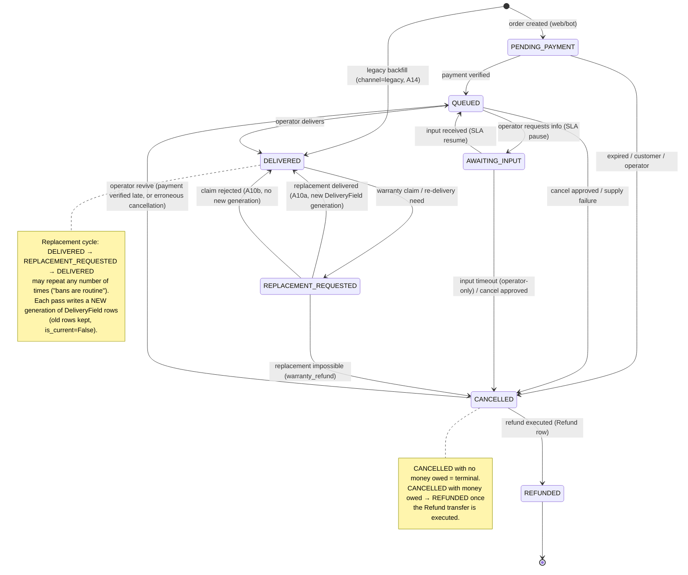

# PremShop — State Machine Specification

> **At a glance.** What an order item may do next, what each change announces, how simultaneous requests are kept safe, and the tests that prove it; the payment machine is kept as intent only.
> **Built:** nothing this document specifies. It leans on built code in places — A1 prices through `effective_price` and reads `Plan.cost_price` and `is_available` (catalog, S3); the login-code send and the sign-in alert in §3 are, today, direct synchronous emails, not events. **Contract for S4a:** §1 in full (the whole matrix, including transitions whose triggers arrive later), §3's item-event rows, §4.1–§4.5 and §4.6's interaction guards, §5 tests 1–17, 33–35, 39, 41, 43, 47–48. *Caveat for S4a's briefing:* several of those rows and tests need tables or tasks that land later — Payment and Refund (S6b/S5), DeliveryField (S7), the unpaid sweep (S5), the input ladder (S8), the outbox (S6) — and what S4a builds for them is open (`docs-local/progress.md`, "For S4a's briefing", items 6–7). **Contract for S4b:** A1 (checkout), §2.3's money display, the discount and cart rules in §4.1–§4.2, test 1, the cart-lifecycle note in §5 — with A1's shape itself open: whether the checkout view goes through `payments.checkout` and creates the Payment row, or calls `orders.place_order` directly (item 5 of the same list). **Intent only**, re-specified at their step: §2 the payment machine (S5), §3's payment and later rows, §4.6's holiday mass action (S10), §4.7 (S5), §4.8 (S9), the S5–S10 tests. The operator's manual payment fallback comes before S5 — at S4b per the note below, at S6b per the build plan (the documents disagree; settled in S4a's briefing).
> **Already fixed regardless of step:** everything named as settled in the firmness note below, including the four payment rules in §2.
> **Read for S4a:** §1 the item machine, §3 Event catalog, §4 Concurrency rules, §5 the item-machine tests.

> **Firmness (owner calibration, 2026-09-01).** Settled now: the 7-status item list, the 5-status payment list, transitions only through services, illegal transitions raise, the executed-Refund gate on REFUNDED, the event-row-inside-the-transaction rule, and the four payment non-negotiables in §2 (verify is the sole source of truth, amount must match, confirm is idempotent, `abandoned` only via inquiry). The per-transition guards/side-effects and the event catalog harden at the step that implements them (item machine → S4a, manual fallback → S4b, gateway machine → S5, notification consumers → S6/S8); until then they are the best current draft. A mid-step discovery that a row here is wrong is a contract conversation, not a workaround.

Scope: OrderItem machine, Payment machine, event catalog, concurrency rules, test list. Implements ADR-0003 (transitions through services), ADR-0005 as amended (money paths, discount codes), ADR-0018 (persistent cart + guest checkout), ADR-0019 (payment gateway — supersedes the card-to-card design of ADR-0006), ADR-0020 (discount codes), plus D7–D11 and D17–D18. All transitions live in `orders/services.py` and `payments/services.py`; any status write outside a service method is a code-review reject.

Conventions used below:

- `PP` = PENDING_PAYMENT, `Q` = QUEUED, `AI` = AWAITING_INPUT, `DEL` = DELIVERED, `RR` = REPLACEMENT_REQUESTED, `CAN` = CANCELLED, `REF` = REFUNDED.
- Every allowed transition: runs inside `transaction.atomic()` with `select_for_update()` on the row, validates the (from, to) pair against this matrix, raises `InvalidTransition` otherwise, writes one `OrderItemEvent` row **inside** the transaction, and calls `events.emit(...)` via `transaction.on_commit()`.
- `compute_due_at(confirmed_at, delivery_hours, schedule)` is the single pure SLA function (D7): wall-clock add, snap **forward** to next support window if outside one, hard cap `confirmed_at + 48h`. The cap applies at computation time only; SLA pauses may legitimately push `due_at` past it.

---

## 1. OrderItem machine

### 1.1 Diagram

### 1.2 Transition grid (every ordered pair)

Rows = from, columns = to. `A#` = allowed, detailed in §1.3. Forbidden cells carry the one-word reason.

| from \ to | PP | Q | AI | DEL | RR | CAN | REF |
|---|---|---|---|---|---|---|---|
| **(creation)** | **A1** | unpaid | unpaid | **A14**² | unpaid | unpaid | unpaid |
| **PP** | no-op | **A2** | unpaid | unpaid | unpaid | **A3** | via-CANCELLED |
| **Q** | paid | no-op | **A4** | **A5** | undelivered | **A6** | via-CANCELLED |
| **AI** | paid | **A7** | no-op | resume-first | undelivered | **A8** | via-CANCELLED |
| **DEL** | paid | via-replacement | via-replacement | no-op¹ | **A9** | via-replacement | via-CANCELLED |
| **RR** | paid | loop-only | loop-only | **A10a/A10b** | no-op | **A11** | via-CANCELLED |
| **CAN** | revive-to-QUEUED | **A13** | revive-to-QUEUED | revive-first | undelivered | no-op | **A12** |
| **REF** | terminal | terminal | terminal | terminal | terminal | terminal | no-op |

¹ Re-delivery is never a DELIVERED→DELIVERED self-transition; it always goes through the A9→A10a loop, even for an operator-side correction (wrong password typed). This keeps every credential generation attributable to an explicit request event.

² Legacy backfill only: creation → DELIVERED is legal solely via the backfill service for `Order.channel='legacy'` (actor system) — see A14. Web/bot orders always start at PP.

Forbidden-reason glossary: **unpaid** = payment not verified; **paid** = money already taken, cannot regress to pre-payment; **undelivered** = replacement states only make sense after a delivery; **resume-first** = must return to QUEUED (restoring the SLA clock) before delivering; **via-replacement** = post-delivery problems route through REPLACEMENT_REQUESTED only (brief: "پس از تحویل: فقط از مسیر گارانتی و تعویض"); **via-CANCELLED** = REFUNDED is only reachable from CANCELLED with an executed Refund row (D2); **loop-only** = RR resolves only to DELIVERED or CANCELLED; **revive-to-QUEUED** = the only exit from CANCELLED besides REFUNDED is the operator revive, and it lands on QUEUED because it is guarded by a **verified** payment; **terminal** = REFUNDED is final; **no-op** = self-transitions are forbidden (holiday SLA annotations and `orders.extend_due_at` write an `OrderItemEvent` with `from_status == to_status` but are not status transitions — see §4.6 and below).

Not a transition (by decision D1): a customer cancellation **request** on a Q/AI item sets `cancellation_requested_at`, emits `item.cancellation_requested`, shows a queue badge; the item's status does not change until the operator approves (A6/A8).

Also not a transition: `orders.extend_due_at(*, item, new_due_at, note, actor='operator')` — legal only in QUEUED; writes an annotation `OrderItemEvent` (`from_status == to_status == QUEUED`, note) and emits `item.supply_delayed` (customer delay notice, C6). This service, `compute_due_at`, and the pause/resume arithmetic (§4.6) are the **only** writers of `due_at`.

### 1.3 Allowed transitions — detail

| # | Transition | Trigger | Actor | Guards | Side effects (all in one transaction unless noted) | Event emitted (on commit) |
|---|---|---|---|---|---|---|
| **A1** | creation → PP | Checkout submits (or bot order) — the view calls only `payments.checkout(*, user, session_key, phone, discount_code=None) -> tuple[Order, str]`, which resolves the cart into `OrderLine`s, runs `orders.place_order(*, user, lines, phone, discount_code, channel)` + Payment creation in ONE transaction, and **then, after that transaction has committed**, requests the gateway token (P-A2) and returns its redirect URL | customer | Every cart plan `is_available`; products active; `holiday_stop_new_orders` off; **prices re-read from the DB through `effective_price(plan)` and recomputed server-side — nothing about money is taken from the cart rows or the form** (ADR-0018); discount code validated server-side (format, window, scope, `per_user_limit` via DiscountRedemption) and its `used_count` incremented under `select_for_update` in this same transaction (ADR-0020); **a plan that requires customer input is limited to quantity 1** — the cart refuses a second unit with a clear message and checkout re-validates it, because each OrderItem is a separate credential with its own lifecycle and three of them would need three separate inputs. That is why `customer_inputs` is a mapping of plan id to a **single** string, which is the shape every service already assumes. Flip condition: if a customer genuinely needs several units of an input-requiring plan, the answer is per-item inputs on the checkout form — never silently reusing one value across items | OrderItem rows created with `price_snapshot` (= `effective_price(plan)` at order time, so an active promotion is what gets charged), `product_snapshot`, `cost_snapshot` (from `Plan.cost_price`), encrypted `customer_input` if collected; order `subtotal`, `discount_amount`, `total_amount` written with `subtotal = Σ price_snapshot`, `total_amount = subtotal − discount_amount`, `total_amount ≥ 0`; one `DiscountRedemption` row written when a code applied; **the customer's CartItem rows are consumed and deleted in this same transaction** — discount validation, the `used_count` increment, the redemption row and the cart clear all sit under the one lock, so a code cannot be spent twice and a cart cannot be ordered twice; Payment created in the same transaction (see P-A1); `OrderItemEvent(NULL→PP, actor)` per item | none (the operator's new-order alert rides on `payment.verified` — an unpaid order is not news) |
| **A2** | PP → Q | Payment reaches `verified` (gateway verify, inquiry beat, or the operator's manual fallback) | system (invoked from payment service) | Item's order's payment is `verified`. Called only from `payments.services.confirm_payment` — never directly | `paid_at = payment.verified_at`; `due_at = compute_due_at(paid_at, product.delivery_hours, schedule)`; `OrderItemEvent(PP→Q, system)` | none — customer messaging rides on `payment.verified`, emitted exactly once by `payments.confirm_payment` (`orders.mark_order_paid` emits nothing) |
| **A3** | PP → CAN | (a) the unpaid-order sweep, past the order's TTL with no `verified` payment; (b) customer cancels unpaid order; (c) operator cancels | system / customer / operator | (a) `order.created_at + SiteSetting.unpaid_order_ttl_hours < now()` (default 24h; the deadline is computed from `created_at`, not stored on the row) **and** the order has no `verified` payment **and** no payment still `initiated` — the sweep always **skips** an in-flight gateway attempt and leaves it to the inquiry beat, because we never cancel while money may be moving. Twenty-four hours is deliberate: the `payment.failed` message promises the customer their order is still there and hands them a retry link, and a half-hour window would make that promise a lie. This TTL is a different clock from `SiteSetting.gateway_timeout_minutes` (§2.4), which governs when the inquiry beat interrogates the gateway — the two are never the same field; (b) item belongs to `request.user`; (c) staff | `cancel_reason` = `expired_unpaid` \| `customer_before_payment` \| `operator`; any `created` payment on the order is simply left behind (dead weight, no cleanup job — the live-payment index is per-order); `OrderItemEvent(PP→CAN, actor, note=reason)` | `item.cancelled` — **no suppression any more**: the card-to-card `payment.expired` notice is gone, so this is the only message the customer gets about an abandoned order |
| **A4** | Q → AI | Operator clicks «درخواست اطلاعات» on the delivery page, with a note | operator | Staff; note non-empty | `sla_paused_at = now()` **only if currently NULL** (may already be holiday-paused, §4.6); `OrderItemEvent(Q→AI, operator, note)` | `item.awaiting_input` |
| **A5** | Q → DEL | Operator clicks «تایید و ارسال به مشتری» on the delivery form | operator | Staff; all required delivery fields present; `sla_paused_at IS NULL` (holiday-paused items must be resumed first — delivering while "paused" would corrupt the resume arithmetic) | DeliveryField rows written (encrypted, `is_current=True`, generation 1); `delivered_at = now()`; `expires_at` set (prefilled from `duration_days`, editable); `actual_cost` saved (prefilled from `cost_snapshot`, editable); delivery-link token issued (≥128-bit random, stored **hashed**, 72h, single-use — D13 as amended, ADR-0008); `OrderItemEvent(Q→DEL, operator)` | `item.delivered` (no credential values; carries the single-use delivery link) |
| **A6** | Q → CAN | Operator approves a cancellation request, or records supply failure, or cancels unilaterally | operator | Staff | `cancel_reason` = `customer_after_payment` \| `supply_failure` \| `operator`; Refund row **created** (not executed) in same transaction when money was taken — via `payments.cancel_with_refund` (see note below the table); `sla_paused_at` cleared; `OrderItemEvent(Q→CAN, operator, note)` | `item.cancelled` |
| **A7** | AI → Q | Customer submits the requested info on their order page, or operator marks resolved | customer / operator | Customer: item ownership (`order.user_id == request.user.id`); input non-empty | `customer_input` updated (encrypted); **SLA resume: `due_at += (now() − sla_paused_at)`; `sla_paused_at = NULL`** — unless holiday pause is still active, in which case `sla_paused_at = now()` immediately after (see §4.6); `OrderItemEvent(AI→Q, actor)` | `item.input_received` |
| **A8** | AI → CAN | Operator cancels/approves at any point; OR the input-timeout ladder ends it — beat re-reminds at 48h, flags the queue at 7 days, sends the automated **final warning naming the deadline at 14 days**, and at **21 days system auto-cancels** (owner-review revision, supersedes the human-only rule; anchor = the AI-entry OrderItemEvent; holiday does not pause the ladder) | operator / system (21-day ladder end only) | Staff; or beat past day 21 since entering AI | `cancel_reason` = `input_timeout` \| `customer_after_payment` \| `operator`; Refund row created if money taken (via `payments.cancel_with_refund` — destination may be blank at creation, collected from the customer before execution); `sla_paused_at` cleared; `OrderItemEvent(AI→CAN, actor)` | `item.cancelled` |
| **A9** | DEL → RR | Customer files a warranty/replacement claim on their order page; or operator opens one (ban discovered, own typo, or a direct warranty refund — DEL→CAN stays forbidden, so the refund route is DEL→RR→CAN via A9+A11) | customer / operator | Customer: ownership + product warranty allows a claim (warranty ≠ «بدون» and within warranty window); operator: staff, no warranty guard | `OrderItemEvent(DEL→RR, actor, note=claim text)` | `item.replacement_requested` |
| **A10a** | RR → DEL (redeliver) | Operator delivers the replacement on the same delivery form | operator | Staff; new delivery fields provided | Current DeliveryField rows set `is_current=False` (kept); new generation written `is_current=True`; `actual_cost` updated (replacement cost added — prefilled, editable); `expires_at` editable; **`delivered_at` is NOT changed** (first-delivery anchor; replacement timing lives in OrderItemEvent); delivery-link token regenerated (previous link dead); `OrderItemEvent(RR→DEL, operator)` | `item.replaced` → customer notice; fires per replacement pass — new `OrderItemEvent.id` ⇒ new outbox `dedupe_key` (D17) |
| **A10b** | RR → DEL (reject claim) | Operator rejects the replacement claim («رد درخواست تعویض») — service `orders.reject_replacement` | operator | Staff; **note required** | **NO new DeliveryField generation** — the current generation stays untouched; `OrderItemEvent(RR→DEL, operator, note)` | `item.replacement_rejected` → customer notice |
| **A11** | RR → CAN | Operator: replacement impossible, warranty refund | operator | Staff | `cancel_reason = warranty_refund`; Refund row created (executed later); superseded DeliveryField rows untouched; delivery-link token invalidated; `OrderItemEvent(RR→CAN, operator, note)` | `item.cancelled` |
| **A12** | CAN → REF | Operator marks the refund as executed (`executed_at` plus `gateway_refund_ref` when the gateway's refund API was used, or `bank_ref` for a manual transfer — ADR-0019 §refunds) | operator | **Service-enforced here in A12 (D2; ADR-0003, transitions only through services — *not* ADR-0007, which is encryption and retention): an executed Refund row (`executed_at NOT NULL`) referencing this item — directly via `order_item` FK, or order-wide (`order_item IS NULL`) on this order's payment — must exist. No row ⇒ `InvalidTransition`.** The refund route (gateway API vs. bank transfer) does not change the gate; only which reference field is filled | `OrderItemEvent(CAN→REF, operator, note=gateway_refund_ref \| bank_ref)` | `item.refunded` |
| **A13** | CAN → Q | Operator "revive". Two justifications, both real: (a) the payment was verified **after** the items were cancelled — the inquiry beat found a completed payment the lost callback never reported (P-A3), or the operator recorded a manual payment (P-A6); (b) the operator is correcting an erroneous cancellation on an order whose payment was verified all along | operator | Staff; the order's payment is `verified` **now** (revive performs no payment transition of its own — it only reads a settled payment); item's `cancel_reason ∈ {expired_unpaid, input_timeout, supply_failure, operator}` **AND no unexecuted Refund row (`executed_at IS NULL`) references the item** — never revive a refunded-path or refund-owed item. The guard lives inside `payments.revive_order`; there is no caller-supplied `has_pending_refund` boolean anywhere | `cancel_reason = NULL`; `cancellation_requested_at = NULL`; `paid_at = payment.verified_at`; **`due_at = compute_due_at(now(), delivery_hours, schedule)` — the SLA clock restarts at the revive, NOT at `verified_at`**: a payment verified weeks ago would otherwise land the revived item instantly overdue, and the operator's delivery clock genuinely starts when the item re-enters the queue; `OrderItemEvent(CAN→Q, operator, note="revive")` | none (the customer already got `payment.verified`; a revive that follows it by minutes needs no second message) |
| **A14** | creation → DEL | Legacy backfill service only (`Order.channel='legacy'`) | system | Backfill service; channel is `legacy` — any other channel raises | `OrderItemEvent(NULL→DEL, system, note='backfill')`; **no Payment rows created, no notifications sent** | none |

Service composition: cancels of **paid** items (A6/A8/A11 with money taken) are invoked through `payments.cancel_with_refund(item, reason, refund_destination, amount, note, actor)` — one composite service that wraps `orders.cancel(...)` + the Refund-row creation atomically, so the panel view calls exactly one service (one-service-per-view). `orders.cancel` itself never touches Refund and is called directly only for unpaid items. Checkout and revive have the same shape: `payments.checkout(...) -> tuple[Order, str]` (A1/P-A1 in one transaction, then the gateway call **after** it commits — see §4.2) and `payments.revive_order(payment) -> Order` (the A13 of every guard-passing item, one transaction, no payment transition). `orders.place_order` receives already-resolved `OrderLine`s (plan, quantity, `customer_input`) — it never sees a cart or a session; resolving the cart is `payments.checkout`'s job.

---

## 2. Payment machine

The gateway payment machine is built at S5 (ADR-0019, which supersedes the card-to-card design of ADR-0006). It exists so that an order is marked paid only on the gateway's own server-side answer or on the operator's recorded manual payment, and so that a customer who paid but never came back from the gateway is still found. Already fixed: the five statuses `created`, `initiated`, `verified`, `failed`, `abandoned`; refunds are Refund rows, never payment statuses (D2); `Payment.method` (`gateway` | `manual`) is a record field, not a branch in the machine; a customer retry is a new Payment row, never a transition back. Four non-negotiables are fixed by ADR-0019, and changing any of them is an ADR, not a patch. (1) Server-to-server verify is the only source of truth: the parameters on the browser's return from the gateway only identify which payment to look at, never whether it was paid. (2) The amount must match: if the amount verify reports differs from `payment.amount`, the payment fails with `amount_mismatch` and the order is never confirmed. (3) Confirmation is idempotent through one locked entry point: `payments.confirm_payment` takes `select_for_update` on the Payment, re-reads its status under that lock, returns unchanged if it is already `verified`, and is the only emitter of `payment.verified`, with the callback, the inquiry beat and the manual fallback all routed through it. (4) `abandoned` is reached only from `initiated`, only by the inquiry beat task, and only after the gateway itself answers that the payment was never completed; a timeout alone never abandons a payment.

Full earlier draft: `git show 027c5d1:docs/state-machine.md` (§2). It is re-specified when S5 is planned.

### 2.0 Non-negotiables

The four rules numbered (1)–(4) above; "rule 3" elsewhere means (3). Their full wording is in the earlier draft (§2.0).

### 2.1–2.2 Diagram and transition grid

In the earlier draft (§2.1, §2.2); re-specified when S5 is planned.

### 2.3 Allowed transitions — detail

The six payment transitions are in the earlier draft (§2.3). Their ids, used in §1 and §4: **P-A1** creation → `created` (checkout, in the order's transaction); **P-A2** `created` → `initiated` (gateway token obtained); **P-A3** `initiated` → `verified` (verify, from the callback or the inquiry beat); **P-A4** `initiated` → `failed`; **P-A5** `initiated` → `abandoned` (inquiry beat only); **P-A6** `created` → `verified` (the operator's manual fallback). The money-display rule below stays contract, because S4b builds the checkout summary.

**P-A1 as drafted — kept verbatim**, because S4b's A1 and §4.2 point here, and whether S4b's checkout creates the Payment row at all is open for S4a's briefing:

| # | Transition | Trigger | Actor | Guards | Side effects | Event |
|---|---|---|---|---|---|---|
| **P-A1** | creation → created | Checkout service (A1), in the same transaction as the order | system | Partial unique on `order_id WHERE status IN ('created','initiated')` forbids two live payments per order — so a retry is legal only once the previous attempt is `failed`/`abandoned`. `idempotency_key` generated, UNIQUE — **its one job is upstream**: it is the key sent to the gateway on the initiate call (P-A2), so a retried token request cannot create two payment requests at the gateway. It plays **no part in confirmation** — that guarantee is `confirm_payment`'s lock-and-re-read (non-negotiable 3), not this column. `amount` is copied from `order.total_amount`, which was computed server-side from DB prices (through `effective_price`) minus a server-validated discount — **never** from the cart rows, the form, or any browser-supplied number | `amount` snapshot; `method='gateway'` (default); no expiry stored on the payment — the order's unpaid TTL is computed from `order.created_at` (A3a), and the inquiry threshold from `initiated_at` (§2.4) | none — nothing has happened yet |

**Money display at the checkout boundary.** The checkout summary — computed server-side and rendered **before** submission, so the customer approves the same numbers the order is then created from — is the last screen before real money moves, so it follows the money rules already in force (`docs/design-language.md`, ADR-0016): Persian digits, ASCII thousands separator, toman only — never rial, the currency word set lighter than the numeral, tabular figures so the column aligns. It shows **three distinct ledger lines — جمع کل (subtotal), تخفیف (discount, negative), مبلغ قابل پرداخت (total)** — using the ledger-line component, never a single opaque number. The amount rendered here and the amount sent to the gateway are the same server-computed `order.total_amount`; nothing on this screen is arithmetic done in the browser.

### 2.4 Lost-callback recovery (mandatory)

A Celery beat task puts every payment still `initiated` past `SiteSetting.gateway_timeout_minutes` to the gateway's inquiry API and settles it on the same path a callback would take: the net for "paid, but the callback never arrived" (ADR-0019). That clock is separate from the order-side `unpaid_order_ttl_hours` (A3a), and an unreachable gateway is never read as an unpaid customer (rule 4).

Full earlier draft: `git show 027c5d1:docs/state-machine.md` (§2.4). It is re-specified when S5 is planned.

---

## 3. Event catalog

`events.emit(name, payload)` runs in `transaction.on_commit`; its only job is creating Notification outbox rows (D18). `OrderItemEvent` rows (the audit trail / public timeline) are written **inside** the transaction and are independent of this catalog. Customer channels: email always; Telegram additionally when linked. Operator alerts: **both** Telegram and email (D17). All customer-facing texts carry no credential values (D13); delivery/replacement notices additionally carry the single-use 72h delivery link — a bearer capability, not content — scrubbed from Sentry and truncated in access logs (ADR-0008). Auth OTP sends are not domain events — they go straight through the channel senders (they must be immediate and never deduped); today the only sender is email, and `apps.accounts.otp.send_login_code` sends the code synchronously through `apps.core.email.send_templated_email`. Dedupe keys follow one rule: `{occurrence}:{recipient}:{channel}`, where recipient is the user id or the literal `op` (operator) — so an operator alert on payment 1041 is `pay:1041:verified:op:telegram`. **This section is the canonical dedupe-key registry**, and the table below, with the intent paragraph after it, is its complete list of prefix families — eleven, not five: `evt:` (any keyed OrderItemEvent), `pay:`, `refund:`, `renew7:`, `renew0:`, `delay:`, `remind:`, `hpause:` / `hresume:`, `signin:`, `cancelreq:`, `overdue:`. Any other document listing key shapes points here rather than enumerating its own subset; a new family is added here first. Transitions that notify emit an event; transitions that don't, don't — there are no consumer-less events. Applied to the gateway machine, that rule deletes three names: **`payment.initiated` is not emitted** (P-A2 — the customer is at the gateway, the operator has nothing to do), **`order.created` is not emitted** (A1 — the operator's new-order alert moved to `payment.verified`, because an unpaid order is not news), and P-A5 `abandoned` emits nothing. The same rule deletes `telegram.linked`: the bot already replies in line when an account is linked, so the event had no consumer either. The card-to-card family — `payment.submitted`, `payment.rejected`, `payment.expired` — is gone with ADR-0006. This catalog is the canonical event registry across all plan artifacts.

| Event | Emitted by | Payload fields | Notifications (recipient · channels · gist) | Dedupe key |
|---|---|---|---|---|
| `item.awaiting_input` | A4 | `order_item_event_id, item_id, note` | customer · email+TG · info needed + order-page link (`/orders/{order_number}/`); SLA-paused notice | `evt:{order_item_event_id}:{user_id}:{channel}` |
| `item.input_received` | A7 | `order_item_event_id, item_id` | operator · TG+email · customer replied, item back in queue | `evt:{order_item_event_id}:op:{channel}` |
| `item.delivered` | A5 | `order_item_event_id, item_id, order_number, delivery_link` | customer · email+TG · «سفارش #۱۰۴۱ تحویل شد» + single-use delivery link + order-page link — **no credential values ever** | `evt:{order_item_event_id}:{user_id}:{channel}` |
| `item.replaced` | A10a | `order_item_event_id, item_id, order_number, delivery_link` | customer · email+TG · replacement delivered (fresh delivery link; old one dead), no credential values. Fires per replacement pass (new `order_item_event_id` ⇒ new key — the reason D17 rejected `unique_together`) | `evt:{order_item_event_id}:{user_id}:{channel}` |
| `item.replacement_rejected` | A10b | `order_item_event_id, item_id, note` | customer · email+TG · claim reviewed, not accepted + order-page link | `evt:{order_item_event_id}:{user_id}:{channel}` |
| `item.replacement_requested` | A9 | `order_item_event_id, item_id, claim_note` | operator · TG+email | `evt:{order_item_event_id}:op:{channel}` |
| `item.cancelled` | A3/6/8/11 | `order_item_event_id, item_id, cancel_reason` | customer · email+TG, template per reason — **no suppression**: with `payment.expired` gone, the `expired_unpaid` template is the only notice a customer gets about an order they never paid for | `evt:{order_item_event_id}:{user_id}:{channel}` |
| `item.refunded` | A12 | `order_item_event_id, item_id, refund_id, amount, refund_ref` — **route-agnostic**: `refund_ref` carries `gateway_refund_ref` or `bank_ref`, whichever the refund used; the customer is never shown which rail it came back on | customer · email+TG · refund sent + its reference | `refund:{refund_id}:{user_id}:{channel}` |
| `item.cancellation_requested` | field-set action (not a transition) | `item_id, requested_at` | operator · TG+email | `cancelreq:{item_id}:{requested_at}:op:{channel}` |
| `item.supply_delayed` | `orders.extend_due_at` (annotation — item stays QUEUED) | `item_id, new_due_at, note` | customer · email+TG · delay notice (C6) | `delay:{item_id}:{new_due_at_iso}:{user_id}:{channel}` |
| `item.input_final_warning` | 14-day ladder beat (item still AI) | `item_id, deadline_at` | customer · email+TG · final warning: respond by {deadline} or the order is cancelled and refunded | `remind:{item_id}:14d:{user_id}:{channel}` |
| `auth.otp_signin` | the code sign-in, only when the account has a usable password (login page or checkout-inline — ADR-0012). **Not an event yet:** today `apps.accounts.services.complete_code_login` sends this alert itself, synchronously, by email through `apps.core.email.send_templated_email`, and a send failure is logged, never raised; this row is its shape once the outbox exists | `user_id, ts, surface` | customer · email + TG-if-linked · new sign-in via one-time code; "change your password if this wasn't you" | `signin:{user_id}:{ts_iso}:{user_id}:{channel}` |

**Rows for S5 and later (intent).** The rest of the registry's eleven families belong to events that no S4a/S4b code emits, so their rows are intent until their step: `payment.verified` (`pay:`; single emitter `payments.confirm_payment`; the customer's confirmation and the operator's new-order alert) and `payment.failed` (`pay:`; a retry link, the order still payable) at S5; and the notices raised by beats rather than by transitions — `sla.holiday_paused` / `sla.holiday_resumed` (`hpause:` / `hresume:`), `subscription.expiring_soon` / `subscription.expired` (`renew7:` / `renew0:`), and the hourly operator `items.overdue_digest` (`overdue:`). All of them follow the key rule above and carry no credential values (D13, ADR-0008).

Full earlier draft: `git show 027c5d1:docs/state-machine.md` (§3). It is re-specified when each row's step is planned.

---

## 4. Concurrency rules

**4.1 Lock scope and ordering.** Every item transition: `SELECT ... FOR UPDATE` on that OrderItem only. Every payment transition: `FOR UPDATE` on the Payment, and when it cascades to items (P-A3/P-A6 + revive), lock the Payment **first**, then its OrderItems ordered by `pk` — one consistent lock order, no deadlocks. Never lock the Order row (nothing transitions on it). The one exception in the checkout path: A1 also takes `select_for_update` on the DiscountCode row to increment `used_count` and write the `DiscountRedemption`, and takes it **before** inserting the order — a code, then an order, then a payment, then the cart clear, always that order.

**4.2 Transaction boundary.** One `transaction.atomic()` per user-visible action, even when it spans machines: "confirm payment" = payment P-A3 (or P-A6) + N × item A2 + N+1 OrderItemEvent-adjacent writes, all-or-nothing. "Revive" = `payments.revive_order(payment)`: the A13s of every guard-passing item, one transaction, reading an already-`verified` payment. "Cancel with refund" = `payments.cancel_with_refund`: item cancel + Refund-row creation, one transaction. "Checkout" = `payments.checkout`: discount validation + `used_count` increment + the `DiscountRedemption` row + `orders.place_order` + Payment creation (P-A1) + **deleting the customer's CartItem rows**, one transaction — so a single-use code cannot be spent twice concurrently, an order never exists without its payment row, and a cart is never both consumed and still sitting there. DeliveryField writes and generation supersession (A10a) are inside the delivery transaction.

**The gateway HTTP call is deliberately outside that transaction.** `payments.checkout` commits the order and its `created` payment first, and only then calls the gateway for a token (P-A2). A gateway that takes eight seconds to answer would otherwise hold the DiscountCode lock and the order's row locks for eight seconds, and a gateway that hangs would hold them until the connection timeout — database locks pinned to a third party's latency. The cost of moving the call out is that a failed token request leaves an order in PENDING_PAYMENT with no redirect; that is the correct outcome, not a leak — the order is payable, the customer retries from its pay page, and A3a eventually cancels it if they never do. The same rule applies to the verify call: the HTTP request happens first, the transaction opens after the answer is in hand.

**4.3 Validate-under-lock.** Status is re-read after acquiring the lock and validated against the matrix there — never trusted from the form/page that rendered the button. `InvalidTransition` carries (from, to) for the log.

**4.4 on_commit enqueue (D18).** `events.emit` is registered with `transaction.on_commit`; it creates outbox rows which the Celery outbox worker picks up (status/attempts/backoff). Notification failure can never roll back a delivery (brief §8). Rollback ⇒ no emit ⇒ no ghost notifications.

**4.5 Double-click / two-tab behavior per operator action.**

| Action | Second click / second tab outcome |
|---|---|
| Deliver (A5) | Second request finds status DELIVERED under lock → `InvalidTransition` → panel returns an HTMX 409 partial: «این سفارش قبلاً تحویل شده» + refreshed row. No second DeliveryField generation. |
| Replacement deliver (A10a) / reject claim (A10b) | Second request finds DELIVERED → same 409 partial. Exactly one new generation per A10a pass; A10b never writes one. |
| Request info (A4) | Second click finds AI → `InvalidTransition` → panel refreshes the row silently (operator's intent already satisfied). |
| Cancel / approve cancellation | Second click finds CAN → 409 partial «قبلاً لغو شده». |
| Revive | Second click finds the items already Q → `InvalidTransition`, panel refreshes. The payment is untouched either way. |
| Mark refund executed (A12) | Second click finds REF → 409 partial. `Refund.executed_at` write is guarded by `executed_at IS NULL` under lock. |

*Payment-side rows (intent, S5):* a refreshed or replayed gateway callback and a double-clicked manual payment both find the payment already `verified` under §2's rule (3) lock and change nothing: no second event, no second set of item transitions. Full earlier draft: `git show 027c5d1:docs/state-machine.md` (§4.5). It is re-specified when S5 is planned.

Customer-side races (callback vs. unpaid-order sweep; input submit vs. operator cancel): the beat/operator holds the lock first or second; loser's guard fails cleanly; the beat treats a lost race as a skip, the customer gets a Persian error page telling them the current state. The A3a sweep additionally refuses to cancel an order with an `initiated` payment, so a customer mid-gateway is never cancelled out from under.

**4.6 Holiday mass pause/resume (D7).** Reuses the `sla_paused_at` arithmetic without a status change. The mass action is S10's holiday switch (D8): it pauses and later resumes every QUEUED item's clock with the same arithmetic as A4/A7, writing an annotation `OrderItemEvent` per item instead of a transition. Interaction guards: A4 does not overwrite an existing `sla_paused_at`; A7 re-stamps `sla_paused_at = now()` when `holiday_pause_sla` is still on; A5 refuses to deliver a paused item (resume first). Consequence to document: `sla_paused_at NOT NULL` no longer implies status AI.

Full earlier draft: `git show 027c5d1:docs/state-machine.md` (§4.6). It is re-specified when S10 is planned.

**4.7 Callback vs. inquiry race.** The one genuinely concurrent path in the payment machine (S5): the customer's return from the gateway and the inquiry beat can try to confirm the same `initiated` payment at the same moment. Both go through `payments.confirm_payment`, so §2's rule (3) settles it: the row lock serializes them, the re-read makes the loser do nothing, and a late failure report can never push a `verified` payment to `failed` or `abandoned` (ADR-0019).

*One live payment per order* rides on the same section: the partial unique on `order_id WHERE status IN ('created','initiated')` is the invariant; the ordinary `IntegrityError` from a concurrent double-checkout is the concurrency control. A retry after `failed`/`abandoned` inserts cleanly because those rows are outside the index. No table locks, no sequences.

Full earlier draft: `git show 027c5d1:docs/state-machine.md` (§4.7). It is re-specified when S5 is planned.

**4.8 Delivery-link redeem.** Opening the customer's no-login delivery link (S9) is a single-use redeem under the item's row lock, so a second concurrent open loses; every invalid, expired or used token gets the same rate-limited 404 (ADR-0008).

Full earlier draft: `git show 027c5d1:docs/state-machine.md` (§4.8). It is re-specified when S9 is planned.

---

## 5. Test list

Money/auth-path tests are non-negotiable (working agreement §11). `pytest` + `factory_boy`; freeze time where arithmetic matters.

**OrderItem transitions — allowed (one test each, asserting: new status, side-effect fields, OrderItemEvent row written in-transaction, correct event emitted on commit via `django_capture_on_commit_callbacks`):**
1. T-A1 creation → PP: snapshots (`price`, `product`, `cost_snapshot`) frozen; `customer_input` stored encrypted (ciphertext in DB ≠ plaintext); **money invariant asserted — `subtotal = Σ price_snapshot`, `total_amount = subtotal − discount_amount`, `total_amount ≥ 0`** including a percent code larger than the order (clamped to zero, never negative); a browser-supplied price/total in the POST is ignored entirely; two concurrent checkouts on a single-use code ⇒ exactly one order carries the discount, the other is refused (ADR-0020); a `DiscountRedemption` row is written for the winning order and none for an order with no code; **the cart is consumed — the CartItem rows are gone after commit, and a rollback (e.g. the discount guard raising) leaves the cart fully intact**; an input-requiring plan is refused at quantity 2 both in the cart and again at checkout (D-D), and `customer_inputs` is asserted to be a plan-id → single-string mapping.
    - **Promotional pricing into the snapshot:** a plan whose promotion is active at order time freezes `price_snapshot = promo_price`, not `sale_price`; a promotion whose window has not opened or has already closed freezes `sale_price`; a promotion that ends **between** the cart page and the submit charges what `effective_price` returns at order time — and that same number is what `subtotal`, `total_amount` and `Payment.amount` are built from. One function, one price, no path that reads `sale_price` directly.
    - **Gateway call outside the transaction (§4.2):** a stubbed gateway that raises on the token request leaves a *committed* order in PENDING_PAYMENT with a `created` payment and an emptied cart — no rollback of the order, no lock held across the call — and the customer's retry from the pay page then succeeds (P-A2).
2. T-A2 PP→Q: `paid_at`, `due_at` set from `compute_due_at`.
3. T-A3 ×3: each actor path sets the right `cancel_reason` (`expired_unpaid`, `customer_before_payment`, `operator`); the unpaid-order sweep (`unpaid_order_ttl_hours`, frozen clock: untouched at 23h, cancelled at 25h) **skips an order whose payment is still `initiated`** — never cancel while money may be moving — and cancels it once that payment lands in `failed`/`abandoned`; the sweep never reads `gateway_timeout_minutes`.
4. T-A4 Q→AI: `sla_paused_at` set; already-holiday-paused item keeps its original `sla_paused_at`.
5. T-A5 Q→DEL: DeliveryField generation 1 `is_current=True`; `delivered_at`, `expires_at`, `actual_cost` saved; refuses when `sla_paused_at` set; refuses when a required template field is missing.
6. T-A6 Q→CAN: Refund row created (not executed) when the payment is `verified`; no Refund row when unpaid.
7. T-A7 AI→Q: `due_at += (now − sla_paused_at)` exactly; `sla_paused_at` NULL after; holiday-active variant re-stamps pause.
8. T-A8 AI→CAN ladder: operator cancel with `cancel_reason=input_timeout` succeeds at any time; beat at 48h re-reminds (outbox row, no status change); at 7d flags the queue; at 14d sends the final warning (`remind:{item}:14d` key, no status change); at 21d system-cancels with `input_timeout` + an unexecuted Refund row with blank destination; holiday mode does not shift the ladder anchor.
9. T-A9 DEL→RR: customer blocked when warranty = «بدون»; operator not blocked.
10. T-A10a RR→DEL redeliver: old rows `is_current=False` and **still present**; new rows current; `actual_cost` updated; `delivered_at` unchanged; `item.replaced` outbox row created (distinct dedupe_key per pass).
11. T-A10b RR→DEL reject-claim: raises without a note; **no new DeliveryField generation** (current generation untouched); `item.replacement_rejected` outbox row created.
12. Repeat-replacement: DEL→RR→DEL→RR→DEL — three generations, exactly one current.
13. T-A11 RR→CAN: `cancel_reason=warranty_refund`, Refund row created (via `payments.cancel_with_refund`, one transaction).
14. T-A12 CAN→REF: succeeds with executed item-level Refund; succeeds with executed order-wide Refund (`order_item IS NULL`); **raises with no Refund row; raises with Refund `executed_at IS NULL`**.
15. T-A13 revive: guarded — raises while the order's payment is not `verified`; **raises when an unexecuted Refund row references the item**; on success `cancel_reason` cleared and the payment row left untouched (revive transitions no payment); **`due_at` is recomputed from `now()`, not from `verified_at`** — frozen clock, a payment verified three weeks ago, revived today ⇒ the item is not overdue on arrival, and `due_at` equals `compute_due_at(now(), …)` to the second.
16. T-A14 legacy backfill: creation→DEL succeeds only for `channel='legacy'` (others raise); `OrderItemEvent(NULL→DEL, note='backfill')`; **no Payment rows, no outbox rows**.

**OrderItem — forbidden:** 17. Parametrized over **all 37 forbidden (from, to) pairs** in §1.2 (49 ordered pairs − 12 allowed; diagonal included; DEL→CAN explicitly among them — direct warranty refunds must route DEL→RR→CAN): service raises `InvalidTransition`, status unchanged, **no** OrderItemEvent row, **no** outbox row.

**Pause/resume arithmetic:** 33. Single pause N hours ⇒ `due_at` exactly +N. 34. Two pause/resume cycles accumulate. 35. Pause may push `due_at` past the 48h cap (cap is compute-time only).

**Cross-cutting:** 39. Double-deliver two-tab test (§4.5): concurrent A5 calls ⇒ one generation, one event, second gets `InvalidTransition`. 41. Ownership: user B calling customer-actor transitions (A7, A9, cancel request) on user A's item ⇒ `PermissionDenied`, no state change. 43. `item.cancelled` fires for **every** reason including `expired_unpaid` (the old suppression is gone with `payment.expired`).

**Not tested here — cart lifecycle (accounts/cart tests, ADR-0018).** The guest→account cart **merge on login** (quantities summed per plan and clamped to the per-line maximum; a claim instead of a merge when the account has no cart, preserving `added_at`), the session cookie surviving a browser close, and the 30-day guest-cart sweep are cart and sign-in behaviour, not status transitions — no OrderItem or Payment changes state, so they belong to their own app's suite and not to this document's list. This machine's only contact with the cart is A1 consuming it (test 1). That merge is the part customers actually notice, so it carries a named test of its own over there.

**Delivery link (ADR-0008):** 47. Issued at A5: raw token appears nowhere in the DB (hash only), expiry = +72h. 48. A10a regenerates: old link 404s, new link works; A11 invalidates.

**Tests for S5 and later (intent).** The numbered tests missing above keep their numbers in the earlier draft, where the build plan's step sections cite them: 18–26, the payment machine and its four rules, with the gateway stubbed at the HTTP boundary (S5); 27–32, the exhaustive frozen-clock table for the business-hours `compute_due_at` (S7); 36–37, the holiday mass pause and its overlap with an item's own pause (S10); 38, `orders.extend_due_at` (S7); 40, the post-payment cancellation request (S9); 42, a failing notification sender never touching item status (S6); 44–46, the end-to-end integrations: happy path through credential reveal, a lost callback recovered by the inquiry beat, and the manual fallback (S5–S9); 49–51, delivery-link redeem under concurrency, the masked no-login view and its uniform 404 (S9).

Full earlier draft: `git show 027c5d1:docs/state-machine.md` (§5). It is re-specified when each test's step is planned.

---

## Concerns

Flagged, not deviated from:

1. **D18 vs. classic outbox:** creating outbox rows in `on_commit` (not inside the transaction) means a process crash in the gap silently drops that occurrence's notifications. Acceptable at this volume — the overdue alarm, operator queue, and dead-man heartbeat are the backstops — but worth one line in the ADR so nobody later "fixes" the ordering without knowing it was chosen. **Accepted at owner review (2026-09-01) — record in the S1 ADR.**
2. **Payment-side, intent (S5):** a `created` payment left behind on a cancelled order is deliberately never cleaned up; it blocks nothing.
3. **Payment-side, intent (S5):** a gateway outage leaves the operator's manual fallback as the only way to take money, which is the ADR-0019 bet. Full earlier draft of both: `git show 027c5d1:docs/state-machine.md` (Concerns 2–3). It is re-specified when S5 is planned.
4. **Cancelling an order with an in-flight `initiated` payment is refused, not queued.** The A3a unpaid-order sweep skips such orders entirely, however far past `unpaid_order_ttl_hours` they are, and waits for the inquiry task to settle the payment first. Consequence: a gateway that never answers an inquiry leaves an order stuck in PP indefinitely. The overdue digest is the backstop — the operator sees it and settles it by hand.
5. **Holiday pause weakens an invariant:** after D7's reuse of `sla_paused_at` on QUEUED items, `sla_paused_at NOT NULL` no longer implies AWAITING_INPUT. Guards in §4.6 and tests 36–37 cover it, but panel code must filter the «منتظر مشتری» tab by status, never by `sla_paused_at`.